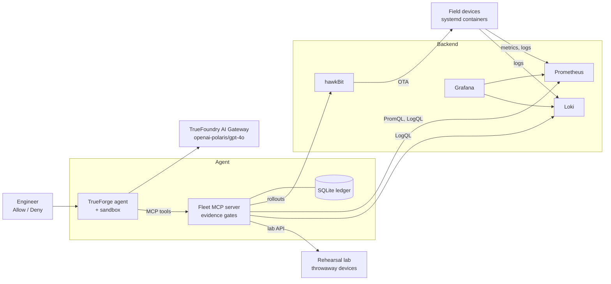

# Wavebreak

**An agent that catches bad OTA firmware rollouts at runtime, ships what is safe, holds what is not, and asks a human before anything irreversible.**

Built for the "Agents That Act" hackathon (HackCulture, TrueFoundry, Polaris).

**What you'll see in the demo** ([script](docs/DEMO.md))
- **v1.3 is blocked in rehearsal.** A config-key rename crashes every device 45 seconds after the install health check. The agent finds it in a throwaway lab; no field device is touched and no approval is needed.
- **v1.2 becomes a partial rollout.** A memory leak hits only the 4K-sensor hardware revision (rev B). The agent ships rev A and holds rev B, with the failed-rehearsal evidence in an audit ledger. Every wave start needs a human Allow.
- **Every action is evidence-gated.** The server refuses stale, wrong-wave or uncovered evidence, and missing data is never treated as healthy.

## The problem

An OTA update to an edge AI fleet "succeeds" when it installs. Real regressions appear after install: a leak that only affects one hardware revision, or a crash that starts minutes later. The OTA server (Eclipse hawkBit) only counts install failures, so the bad release keeps spreading. People then correlate metrics, logs and rollout history by hand, while the rollout continues.

## How it works

1. **Inventory** the fleet (version x hardware revision x region).
2. **Plan stratified waves**: wave 1 mixes hardware revisions; each wave is its own hawkBit rollout, so success in one cannot auto-start the next.
3. **Rehearse in an isolated lab**: one throwaway device per hardware revision, watched for restarts, OOM kills and memory slope.
4. **Approval-gated wave**: `start_wave` needs fresh passing evidence and a human Allow; the prompt shows the evidence summary.
5. **Observe against control**: updated devices are compared with same-revision devices still on the old version.
6. **Decide**: promote the next wave, **hold** a failing cohort (partial rollout), or **halt and roll back** the affected cohort, then verify recovery.
7. **Audit report** from an append-only ledger (evidence ids, holds, approvals, decisions).



More diagrams (C4 levels, sequence flows for each scene, fault catalogue, state machine): [`docs/architecture.md`](docs/architecture.md), or open [`docs/view/index.html`](docs/view/index.html) (press `P` for slides). If GitHub Pages is enabled for `/docs` (Settings, Pages), it is served at `/view/`.

## Challenge requirements

| Requirement | How Wavebreak does it | Look at |
|---|---|---|
| Reach a real system | Real Eclipse hawkBit (rollouts, DDI), Prometheus, Loki, Grafana, and a lab controller that boots throwaway systemd devices. Only the hardware and the firmware payload are simulated; faults are real code, not fabricated logs | `agent/fleet_mcp/backends.py`, `lab/controller/app.py`, `platform/docker-compose.yml`, `sim/bundles/` |
| Run generated code in a sandbox | TrueForge's local sandbox (bubblewrap) is enabled for Code Mode and skills; sandboxed code has no route to devices and cannot call approval-gated tools. The scripted scenes run on MCP tools, so the sandbox is available rather than exercised | `agent/register.py` (`sandbox.enabled`), `infra/aws/install.sh`, `docs/agent-design.md` section 19 |
| Stop for human approval | The TrueForge harness pauses `start_wave`, `halt_rollout` and `rollback` by tool name until Allow or Deny; the prompt carries a required evidence summary | `agent/register.py` (`require_approval_for_tools`), `agent/fleet_mcp/server.py` |

## Safety model

- **Harness-enforced approvals by tool name**, plus destructive annotations; gated tools are refused from Code Mode.
- **Server-side evidence gates** that do not trust the model: evidence must be of the right kind, the latest of its kind, fresh (15 min), for the right plan and wave, and the rehearsal must cover every hardware revision of the plan (`agent/fleet_mcp/preconditions.py`).
- **Fail closed**: Prometheus, Loki or lab errors, missing series, or missing control data give `inconclusive`, never `healthy`; inconclusive evidence cannot start a wave (`agent/fleet_mcp/assess.py`).
- **Held cohorts** need fresh failed-rehearsal evidence and are recorded, never rolled out.
- **Ledger audit trail**: rehearsals, observations, holds, approvals (with the evidence summary the human saw) and decisions (`agent/fleet_mcp/ledger.py`).

## Stack

TrueForge (agent harness, MCP, sandbox) · TrueFoundry AI Gateway with `openai-polaris/gpt-4o` (Gemini is the documented fallback) · custom fleet MCP server (Python, 11 tools) · AWS EC2 `m7i.2xlarge` · Eclipse hawkBit · Prometheus · Loki · Grafana · Docker with systemd devices.

## Results

| Scene | Outcome |
|---|---|
| 1. v1.3 | Blocked in rehearsal on both hardware revisions; 0 field devices touched; no approval requested |
| 2. v1.2 | Rev A ships and stays healthy, rev B held on v1.1 with its evidence; about $0.10 of model cost per run on `gpt-4o`, about 11 minutes with one lab device |
| 3. v1.4 | Full stratified rollout, 4 of 4 devices healthy (verified on an earlier model) |

Tests: 500 pass across four suites (`agent` 416, `sim/ota-agent` 29, `sim/inference-app` 41, `wavebreak_clients` 14). Details and timings: [`agent/STATUS.md`](agent/STATUS.md).

## Run it

**Local** (lite: 4 devices, about 3.5 GB RAM). Put `TFY_BASE_URL`, `TFY_API_KEY`, `TFY_MODEL` in git-ignored `agent/spike/.env` (template in `.env.example`):

```bash
cp .env.example .env && make up PROFILE=lite && make bundles publish && make grafana-sa
make demo-reset            # 4 devices on v1.1 and healthy
python3 -m venv .venv && .venv/bin/pip install -r agent/requirements.txt
agent/spike/start_trueforge.sh && agent/start_fleet_mcp.sh && .venv/bin/python agent/register.py --register-provider
# chat: http://localhost:8790   Grafana: http://localhost:3000
```

**AWS** (full: 20 devices): `AWS_HOST=ubuntu@<EC2_PUBLIC_IP> AWS_KEY=~/.ssh/<KEY>.pem make aws-sync`, then run `infra/aws/install.sh` on the instance, register the agent, and `sudo make demo-reset PROFILE=full`. Steps, SSH tunnel and verification: [`docs/aws-deploy.md`](docs/aws-deploy.md). Live demo script: [`docs/DEMO.md`](docs/DEMO.md).

## Repo map

| Path | Purpose |
|---|---|
| `agent/` | Fleet MCP server (`fleet_mcp/`), TrueForge registration, driver, instructions, status |
| `sim/` | Simulated device image, ota-agent, releases v1.0 to v1.4 (`bundles/`), fleet launcher |
| `lab/controller/` | Isolated rehearsal lab API |
| `platform/` | Compose stack: hawkBit, Prometheus, Loki, Grafana, mcp-grafana |
| `infra/aws/`, `scripts/` | AWS installer, sync, demo reset and status |
| `wavebreak_clients/` | Thin hawkBit, Prometheus and Loki clients |
| `docs/` | [`architecture.md`](docs/architecture.md) (environment, drift report), [`agent-design.md`](docs/agent-design.md) (agent deep dive, decisions), [`DEMO.md`](docs/DEMO.md), [`aws-deploy.md`](docs/aws-deploy.md), [`view/index.html`](docs/view/index.html) |

Project rules for AI coding tools: [`AGENTS.md`](AGENTS.md). License: [MIT](LICENSE).

## Honest limitations

- **Devices are simulated** (real systemd, real cgroup limits and telemetry). Firecracker microVMs are not implemented.
- **Model flakiness.** Some models end their turn after proposing an action; type `proceed` and the agent must then call the tool. Only one clean `gpt-4o` run of Scene 2 exists; Scenes 1 and 3 were verified on other models.
- **Rollback path** (halt, rollback, verify recovery) is unit-tested against mock backends only, not run on a live fleet.
- Rehearsal covers only its window (about 2 minutes); later-onset faults are caught by the soak in the next wave, not in the lab.
- The fleet MCP server has no authentication and trusts the harness's approval (localhost only). Known deviations from the design are listed in the drift report, `docs/architecture.md` section 12.
- `make test` currently stops at `lab/controller` (no tests there); run the suites as listed above.
