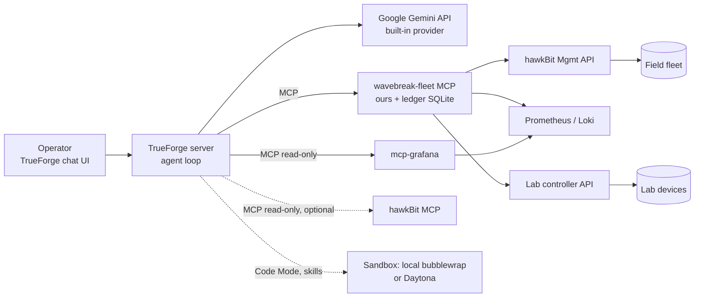
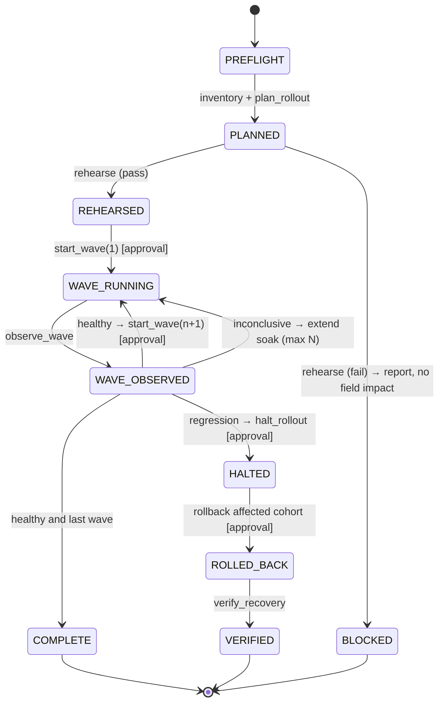

# Wavebreak — Agent Design (Part B)

> Catches bad OTA rollouts at runtime and rolls them back, with your approval.
> Status: implemented; Scene 3 verified end to end through TrueForge 2026-09-26 (§20). Source of truth for agent design and intent; environment facts live in `docs/architecture.md` (which also holds the drift report).

## Index

1. [Context and goal](#1-context-and-goal)
2. [Problem the agent solves](#2-problem-the-agent-solves)
3. [Environment the agent operates on](#3-environment-the-agent-operates-on)
4. [TrueForge: what it is](#4-trueforge-what-it-is)
5. [TrueForge: limitations and what they mean for us](#5-trueforge-limitations-and-what-they-mean-for-us)
6. [Controllables map](#6-controllables-map)
7. [Design patterns adopted](#7-design-patterns-adopted)
8. [Agent-layer architecture](#8-agent-layer-architecture)
9. [Rollout state machine](#9-rollout-state-machine)
10. [Fleet MCP server: tool specs](#10-fleet-mcp-server-tool-specs)
11. [Ledger (rollout state store)](#11-ledger-rollout-state-store)
12. [Evidence model and verdict rules](#12-evidence-model-and-verdict-rules)
13. [Human-in-the-loop design](#13-human-in-the-loop-design)
14. [Agent spec (draft)](#14-agent-spec-draft)
15. [Instructions (draft)](#15-instructions-draft)
16. [Context and memory strategy](#16-context-and-memory-strategy)
17. [Soak / waiting strategy](#17-soak--waiting-strategy)
18. [Subagents policy](#18-subagents-policy)
19. [Sandbox usage](#19-sandbox-usage)
20. [Demo script](#20-demo-script)
21. [Verify-first checklist](#21-verify-first-checklist)
22. [Open questions](#22-open-questions)
23. [Decisions log](#23-decisions-log)
24. [Sources](#24-sources)

---

## 1. Context and goal

- Hackathon: "Agents That Act" (HackCulture; TrueFoundry + Polaris). Build window: 6–7 h.
- Required of the agent: reach a real system; run generated code safely in a sandbox; stop before irreversible actions and wait for human approval.
- Mandatory stack: TrueFoundry, TrueForge (MIT agent harness), AWS.
- Agent role: **rollout manager**, not a passive monitor. Given "a new build is published, take care of the rollout", it owns the rollout end to end: inventory → plan → rehearse → canary waves → observe → promote / halt / roll back → report.
- Runs until: rollout complete, rollout halted/rolled back and reported, or the user stops it.

## 2. Problem the agent solves

- OTA servers judge an update by **install** success. Runtime regressions (memory leak → OOM loop, crash on first config reload, FPS drop) appear minutes later, often only on a subset (hardware revision, region).
- hawkBit rollout thresholds count install failures only, so a runtime regression is recorded as "success" and spreads to the next group.
- Humans then correlate metrics, logs and rollout history across the fleet by hand.
- Wavebreak closes the gap between "installed" and "healthy".

## 3. Environment the agent operates on

Summary only; details in `docs/architecture.md`.

| Zone | Components |
|---|---|
| backend | hawkBit (OTA server + UI + Management API + DDI), Prometheus (remote-write receiver), Loki, Grafana, mcp-grafana |
| field | Device fleet (container or Firecracker runtime), all on one version before a rollout; 20 devices on AWS (lite: 4 locally) |
| lab | Rehearsal lab: isolated throwaway devices + lab controller API; never touches production hawkBit/Prometheus/Loki |

- Device labels on every metric/log: `device_id`, `hw_rev` (A/B), `region`, `fw_version`.
- Key metrics: `wavebreak_app_info{fw_version}`, `wavebreak_app_rss_bytes`, `wavebreak_app_cgroup_memory_bytes`, `wavebreak_app_restarts_total`, `wavebreak_app_fps`, `wavebreak_app_cache_items`, `wavebreak_device_boot_time_seconds`. OOM kills and crash loops also in journald → Loki.
- Releases (app bundles, A/B slots, real code diffs):

| Version | Behaviour | Visible when |
|---|---|---|
| v1.0 | Baseline | — |
| v1.1 | Good; adds a feature | — |
| v1.2 | 4K buffer never evicted → OOM loop on **rev B only** | ~3 min after install |
| v1.3 | Renamed config key → crash on first config reload, **all devices** | ~45 s after start (after install health check passes) |
| v1.4 | Fix for v1.2 | — |

## 4. TrueForge: what it is

- Open-source harness that runs the agent loop: model calls, MCP tools, skills, sandboxing, approvals, context management, session state. Exposed via chat UI, HTTP API + TypeScript/Python SDK, embeddable UI SDK.
- Modes: **local** (one process, SQLite, no login, localhost only) or **hosted** (Postgres + Redis, Docker Compose or Helm).
- An **agent = spec**: `model` (+ params), `instructions`, `mcp_servers` (per-server tool selection, approval rules, preload), `skills`, `config` (sandbox, generative UI, ask-user questions, dynamic subagents, context management, iteration limit), `response_format`, seed `messages`. Only `model` is required.
- Runs = **sessions** with **turns**; events streamed; driven from the UI or SDK.
- Built-in context engineering: deferred tool loading, subagents, large-result offloading to sandbox files, Code Mode, compaction.

## 5. TrueForge: limitations and what they mean for us

| Limitation | Implication for Wavebreak |
|---|---|
| Tools come **only from remote MCP servers** (URL; no auth, header auth or OAuth) plus built-ins. No in-process function tools. | Every capability is an MCP server. The rehearsal lab needs an MCP wrapper. |
| **Outbound URL guard** (verified 2026-09-26): MCP server URLs on loopback/private/`.internal`-style hosts are rejected (`Outbound URL blocked for host`). Override: env `OUTBOUND_URL_ALLOWED_HOSTS='["127.0.0.1"]'` (JSON array) at TrueForge start. | Start TrueForge with the allowlist for our MCP servers (`agent/spike/start_trueforge.sh`). |
| Sandbox providers: **Daytona (cloud) or a built-in local fallback** (bubblewrap via Anthropic `sandbox-runtime`, Linux/macOS). The earlier "Daytona only" statement was wrong for OSS v0.2.1. Local fallback needs `bwrap`, `socat`, `rg` on the host and is picked at startup; no config needed. Details §19. | Skills and Code Mode work with no cloud key. Sandbox still cannot run our devices or reach our KVM/networks (lab stays on our host). |
| MCP calls from Code Mode are bridged through the harness (in-sandbox `mcp-client`, unix socket). Tools that require approval are refused from the sandbox (`requires interactive handling and is not callable from sandbox`). **Tools that do not require approval run from Code Mode with no pause**, including unannotated writes (verified). | Sandbox never needs network access to our infra; credentials stay in the harness. Every write tool must be named in `require_approval_for_tools`, or else it is callable ungated from Code Mode. |
| Per-tool-call timeout: env `MCP_REQUEST_TIMEOUT_MS`, default 240000 ms (verified: 120 s ok, 300 s cut at about 226 s; with 900000 a 300 s call ok). Connect timeout 30 s (`MCP_CONNECT_TIMEOUT_MS`). | A blocking `observe_wave` is feasible; set the env var above the longest window. See §17. |
| **Model providers:** built-in Anthropic, OpenAI, Google Gemini, Fireworks, Z.ai, Moonshot, Together, Alibaba, plus `custom` (base_url + api_key). A `truefoundry` provider type (AI Gateway base_url) exists in the schema but needs a gateway we do not have. | We use Google Gemini directly (A13). |
| **Gemini free tier rate limits** (verified 2026-09-26): 5 requests/min per model for `gemini-3.6-flash`, `gemini-3.8-flash`; 15 requests/min for `gemini-3.5-flash-lite` and `gemini-3.1-flash-lite`. One agent-loop step is one request. | A rollout with many tool calls will hit 429 mid-turn on the 5 RPM models. Use a paid key or the lite model for rehearsals; see §22. **Also observed 2026-09-26: a free-tier daily cap of 20 requests per model per day (`generate_content_free_tier_requests`, PerDayPerProjectPerModel); one full scene needs about 20 requests, so two scenes on the free key exhaust it. Use a paid key for the demo.** The TrueForge instance only has `gemini-3-6-flash` and `gemini-3-5-flash-lite` configured; the lite model rejects `reasoning_effort` (422), so `register.py --model` omits it for lite models. |
| **Subagents are dynamic**: root agent spawns them via a built-in tool with instructions it writes. Same tools and sandbox. No nesting. Cannot ask the user. Their approval-gated calls still pause. Parallel; root waits for all. | We cannot define named specialist subagents. We steer usage via instructions. A fixed specialist would have to be a separate saved agent called from our code (not needed). |
| Default approval gates only tools annotated **destructive**. Unannotated tools match neither `@write` nor `@destructive` and run **without approval**. | Always list risky tools **by name** in `require_approval_for_tools`; also annotate our own tools. |
| No scheduler, no native wait. A turn runs until done or `iteration_limit` (default 100, max 1024). | Soak periods need a design (§17). |
| Compaction at ~80% of context is lossy in working context (full event history stays queryable via API). No cross-session memory feature found. | Rollout state must live outside the agent (§11). |
| Local mode has no login and is localhost-only. | Fine for the demo on one host; hosted mode only if the judges need remote access. |

## 6. Controllables map

| Lever | Where set | Our use |
|---|---|---|
| Model + params (reasoning effort, temperature, max tokens) | Spec (UI/API) | Strong model, low temperature |
| Model routing | Settings → Models (API: `PUT /api/v1/settings/model-providers`) | Google Gemini via the built-in provider (AI Gateway not available in OSS; A13) |
| Instructions | Spec | Role, phase order, safety rules; short |
| Skills (SKILL.md, git-backed, loaded on demand) | Spec (needs sandbox) | `rollout-playbook`: thresholds, decision rules, report format |
| MCP servers attached | Spec | wavebreak-fleet (ours), grafana (read-only), hawkbit (reads, optional) |
| Tool enable/disable per server (`enable_tools`, `disable_tools`, `@read-only`) | Spec (API) | Grafana and hawkBit read-only; all actions only via our server |
| Approval list (`require_approval_for_tools`) | Spec | Named: `start_wave`, `halt_rollout`, `rollback` |
| Preload vs deferred tools | Spec | Preload wavebreak-fleet; defer grafana |
| **Tool design inside our MCP** | **Our code (biggest lever)** | Coarse tools, summarized outputs, `evidence_id` preconditions, annotations, precise descriptions |
| Sandbox + Code Mode | Spec `config.sandbox.enabled` (local fallback needs no key) | Stats computed in Python, not prose |
| Large-response offload, compaction | Spec (API) | Leave on; ledger makes compaction safe |
| Dynamic subagents | Spec + instructions | Only for parallel per-cohort evidence gathering |
| Ask-user questions | Spec | Halt vs roll back; proceed to next wave |
| Generative UI | Spec + instructions | Evidence cards, wave tables, memory charts |
| Iteration limit | Spec (API) | ~300 for a full rollout |
| Response format (JSON schema) | Spec (API) | Structured final rollout report (SDK-driven runs) |
| Seed messages | Spec (API) | Every session starts by reading fleet + rollout state |
| Sessions/turns via SDK | Our code | Optional driver sending "continue" after soaks |

**Not controllable → pushed into our MCP server:** subagent definitions/models, nesting, the loop's step logic, forcing a tool at a given step, sandbox provider, scheduling/waiting, cross-session memory.

## 7. Design patterns adopted

1. **Workflow with judgment gates.** Phases are known; mechanics live in tools; the LLM judges at gates (regression? cause? halt or roll back?).
2. **Harness-enforced human approval.** Irreversible actions are named approval-gated tools; safety does not depend on the prompt.
3. **Evidence before verdict, enforced structurally.** Action tools require a fresh `evidence_id` from `rehearse` / `observe_wave`; the server refuses otherwise.
4. **Externalized state.** hawkBit = what happened; ledger = why (evidence, decisions, approvals).
5. **Coarse, intent-level tools** with summarized outputs (fewer steps, fewer tokens, less hallucination).
6. **Control-group comparison.** Updated cohort vs non-updated devices of the same hw_rev over the same window, plus before/after baseline; avoids blaming the update for fleet-wide issues.
7. **Stratified canaries.** Every wave includes every hw_rev present in the fleet, so a rev-B-only bug cannot slip past a rev-A-only canary.
8. **Honest outcomes.** "Inconclusive / cause not found" is a valid verdict.
9. **No multi-agent orchestration.** One root agent; subagents only for parallel evidence gathering.

## 8. Agent-layer architecture



- Why our own MCP server even if hawkBit's MCP is good: (a) evidence requires joining hawkBit state with Prometheus/Loki; (b) the lab is not part of hawkBit; (c) gated actions must check evidence and write the ledger. hawkBit MCP may still be used for raw reads (check its tool list in `docs/architecture.md`, research commit `f4ae57b`).
- One hawkBit rollout **per wave**, started explicitly by the agent, so hawkBit's auto-cascade (triggered by install success) never promotes a wave before runtime verification. Alternative if supported by the running version: prevent auto-start and trigger the next group via API (verify).

## 9. Rollout state machine



Default waves: 2 → 5 → all remaining, stratified by hw_rev. **Partial rollout (A18):** a BLOCKED plan whose rehearsal failed for only some hw_revs is followed by a new plan (`plan_rollout ... exclude_hw_revs, exclusion_evidence_id`) that holds those hw_revs out; the new plan is rehearsed again for the kept hw_revs and proceeds normally. The hold is recorded in the ledger and shown as `held` by `get_rollout_state`; held devices stay on `from_version` and are listed in the final report as pending a fix.

## 10. Fleet MCP server: tool specs

All outputs are summaries (no raw time series). Every call writes an event to the ledger.

| Tool | Inputs | Returns | Preconditions | Approval | Annotation |
|---|---|---|---|---|---|
| `get_fleet_inventory` | — | counts by version × hw_rev × region; device list | — | no | readOnly |
| `get_rollout_state` | `plan_id?` | phase, waves (targets, status), evidence ids, decisions, approvals | — | no | readOnly |
| `plan_rollout` | `version`, `waves=[2,5,"rest"]`, `stratify_by="hw_rev"`, `exclude_hw_revs?`, `exclusion_evidence_id?` | `plan_id`, wave → device list, `excluded`, `held` | version exists as distribution set; no active plan (unstarted plans are superseded); holds need failed-rehearsal evidence (§10.1) | no | write (non-destructive) |
| `rehearse` | `plan_id`, `hw_revs`, `minutes` (≤ lab max) | `evidence_id`, per-hw_rev verdict + metrics (memory slope, restarts, OOM, crash loop, install result) | plan exists | no | write (lab only) |
| `get_bundle_diff` | `from_version`, `to_version` | changed files + short diff summary | — | no | readOnly |
| `start_wave` | `plan_id`, `wave`, `evidence_id` | hawkBit rollout id, targets, start time | wave 1: passing rehearsal evidence; wave n: healthy `observe_wave` evidence for wave n-1; evidence fresh (≤ X min) | **yes** | destructive |
| `observe_wave` | `plan_id`, `wave`, `minutes` (bounded) | `evidence_id`, updated vs control per hw_rev, install status, verdict hint | wave started | no | readOnly (+ ledger write) |
| `record_decision` | `plan_id`, `decision`, `rationale`, `evidence_ids[]` | ok | evidence ids exist | no | write |
| `halt_rollout` | `plan_id`, `evidence_id` | stopped rollouts, pending actions cancelled | regression evidence | **yes** | destructive |
| `rollback` | `plan_id`, `cohort` or `targets[]`, `to_version`, `evidence_id` | assignment actions created | regression evidence; `to_version` = last known good | **yes** | destructive |
| `verify_recovery` | `plan_id`, `targets[]`, `minutes` | `evidence_id`, recovered yes/no per device | rollback executed | no | readOnly |

Lab calls (`rehearse`) go through the lab controller: create lab devices at the fleet's current version per hw_rev, install the target bundle (fetched read-only from hawkBit), sample, destroy.

### 10.1 Implementation semantics (fleet MCP server, `agent/fleet_mcp/`)

Decided 2026-09-26. Approval semantics (user decision): approve every `start_wave`, `halt_rollout`, `rollback`. Demo fleet starts on v1.1.

**Config (env):** `HAWKBIT_URL`, `HAWKBIT_USERNAME`, `HAWKBIT_PASSWORD`, `PROMETHEUS_URL`, `LOKI_URL`, `LAB_CONTROLLER_URL`, `LAB_API_TOKEN`, `FLEET_LEDGER_PATH` (SQLite file, volume path), `FLEET_MCP_HOST` (127.0.0.1), `FLEET_MCP_PORT` (8792), `FLEET_LAB_MOCK` (0/1), `FLEET_EVIDENCE_MAX_AGE_S` (900), `FLEET_LAB_MAX_MINUTES` (5), `FLEET_OBSERVE_MAX_MINUTES` (4), `FLEET_POLL_INTERVAL_S` (15), `BUNDLES_DIR` (`sim/bundles`), distribution set name `wavebreak-app`.

**Phases:** PLANNED, REHEARSED, BLOCKED, WAVE_RUNNING, WAVE_OBSERVED, COMPLETE, HALTED, ROLLED_BACK, VERIFIED (§9; PREFLIGHT is not stored). Terminal: BLOCKED, COMPLETE, VERIFIED. A new plan is refused (`ACTIVE_PLAN_EXISTS`) while another plan is in WAVE_RUNNING, WAVE_OBSERVED, HALTED or ROLLED_BACK; a PLANNED or REHEARSED plan (nothing in the field yet) is superseded: set to BLOCKED with a `superseded` event.

**Evidence:** id `ev-<8 hex>`; ledger event of type rehearsal, observation or verification with payload `{verdict, ...}`. Verdict values: rehearsal `pass|fail`, observation `healthy|regression|inconclusive`, verification `recovered|not_recovered`. Fresh means age <= `FLEET_EVIDENCE_MAX_AGE_S`. An action must use the **latest** evidence of its kind (a newer observation of the same wave supersedes older ones).

| Tool | Preconditions (all enforced server-side; refusal raises a tool error with a stable code and writes an `error` event) |
|---|---|
| `start_wave(plan, wave=1, evidence)` | phase REHEARSED; evidence is the latest `rehearsal` of the plan, verdict `pass`, fresh |
| `start_wave(plan, wave=n>1, evidence)` | phase WAVE_OBSERVED; wave n-1 started and n not started; evidence is the latest `observation` of wave n-1, verdict `healthy`, fresh |
| `observe_wave(plan, wave, minutes)` | wave is the latest started wave; phase WAVE_RUNNING, WAVE_OBSERVED or HALTED (HALTED only refreshes stale regression evidence before `rollback`; the phase is not changed); minutes clamped to `FLEET_OBSERVE_MAX_MINUTES` |
| `halt_rollout(plan, evidence)` | phase WAVE_OBSERVED; evidence is the latest `observation` of the latest wave, verdict `regression`, fresh |
| `rollback(plan, cohort or targets, to_version, evidence)` | phase HALTED; `to_version` equals the plan's `from_version`; evidence is the regression evidence used to halt (or a newer regression observation), fresh; every target is an updated device of the plan whose hw_rev is in the evidence `affected_hw_revs` |
| `verify_recovery(plan, targets, minutes)` | phase ROLLED_BACK; targets are a subset of rolled-back devices |
| `rehearse(plan, hw_revs, minutes)` | phase PLANNED or REHEARSED (re-run refreshes stale evidence); hw_revs subset of the plan's hw_revs (default all); minutes clamped to `FLEET_LAB_MAX_MINUTES` |
| `record_decision` | plan exists; all evidence ids exist and belong to the plan |

Refusal codes: `PLAN_NOT_FOUND`, `BAD_PHASE`, `EVIDENCE_MISSING`, `EVIDENCE_WRONG_PLAN`, `EVIDENCE_WRONG_KIND`, `EVIDENCE_WRONG_WAVE`, `EVIDENCE_WRONG_VERSION`, `EVIDENCE_STALE`, `EVIDENCE_SUPERSEDED`, `EVIDENCE_VERDICT`, `WAVE_ORDER`, `WRONG_TARGET_VERSION`, `TARGET_NOT_ELIGIBLE`, `ACTIVE_PLAN_EXISTS`, `UNKNOWN_VERSION`, `BAD_ARGUMENT`; backend failures raise `BACKEND_ERROR` and `LAB_ERROR` (not in the `CODES` tuple).

**Partial rollout (hold), decided 2026-09-26 (A18):** `plan_rollout(version, waves, stratify_by, exclude_hw_revs, exclusion_evidence_id)`. Excluding a cohort requires `exclusion_evidence_id`: rehearsal evidence (`type` rehearsal) whose `version` equals the plan's version and whose `per_hw_rev[hw].verdict` is `fail` for **every** excluded hw_rev. The evidence may come from an earlier, BLOCKED plan; no freshness or latest-of-kind check applies (a hold is a scope reduction, and stricter checks live on the actions). Refusals: `EVIDENCE_MISSING` (no or unknown id), `EVIDENCE_WRONG_KIND`, `EVIDENCE_WRONG_VERSION`, `EVIDENCE_VERDICT` (that hw_rev did not fail or was not rehearsed), `BAD_ARGUMENT` (no eligible device with that hw_rev, or every device held). On success the new plan contains only the kept devices; the held devices are stored in the plan (`held`: hw_rev, device ids, evidence id, reasons), a `hold` ledger event `{hw_revs, device_ids, evidence_id, source_plan_id, reasons}` is written, `excluded` lists them with the reason `held: hw_rev B failed rehearsal <ev>`, and `get_rollout_state` returns `held` with each device's current installed version. The new plan must be rehearsed (`rehearse` covers the kept hw_revs) before `start_wave`. Nothing in any later tool can add a held device to a wave. Unit tests: `agent/fleet_mcp/tests/test_fleet.py` section 11.

**Other implementation facts (audit 2026-09-26):** `get_rollout_state` also returns `next_allowed`, `actions`, `recent_errors`, per-device `installed_version` and `held`; lists are capped (evidence, decisions, approvals and actions last 10, errors last 5, devices 100). `rehearse` creates lab devices in batches of `FLEET_LAB_PARALLEL` (server default 2; `agent/start_fleet_mcp.sh` sets 1 for the memory-limited local host, the AWS installer sets 2). `rollback.cohort` is an attribute dict such as `{"hw_rev": "B"}`; exactly one of `cohort` or `targets` is required. `verify_recovery.targets` defaults to all rolled-back devices. `start_wave` waits up to 60 s for the hawkBit rollout to reach `ready`, then starts it; a failure raises `BACKEND_ERROR` and nothing is started. Extra env vars: `FLEET_LAB_PARALLEL`, `FLEET_LAB_MOCK_TIME_SCALE`, `FLEET_TH_<FIELD>` (threshold overrides); `FLEET_LEDGER_PATH` defaults to `run/fleet-ledger.sqlite` and the server runs as a host process (`agent/start_fleet_mcp.sh`), not in a container. The `superseded` marker is an `action` event with `kind: superseded`.

**Wave planning (`plan_rollout`):** eligible devices are field targets whose installed version differs from the requested version; `from_version` is the most common installed version among eligible devices, others are listed in `excluded` with a reason. Wave sizes are ints or `"rest"`. Stratified round-robin: for each wave, cycle over the strata (hw_rev, sorted) taking one device at a time until the wave is full; within a stratum, order devices by region round-robin then id, so waves spread across regions. If a wave is smaller than the number of strata it gets one device from the first strata and the plan carries a `not_stratified` warning. `"rest"` takes all remaining devices. Empty waves are dropped. Deterministic for the same inventory.

**Actions (real backend):** `start_wave` creates one single-group hawkBit rollout (`HawkbitClient.create_wave`, filter `controllerId=in=(a,b)`, TODO(verify) FIQL form) for the wave's devices and starts it explicitly. `halt_rollout` stops every started rollout of the plan that is not finished. `rollback` assigns `from_version` (forced) to each target. The harness approval happens before the tool call; the ledger records an `approval` event (`approved_via: harness`) and an `action` event for each executed action.

**Verdict rules (`assess`, pure function; thresholds env-overridable):** per hw_rev, updated devices vs control devices (same hw_rev, plan devices not yet updated or non-plan devices still on `from_version`); if a hw_rev has no control device, each updated device's own pre-update stats are the control (`control_type: baseline`). Signals: `oom` (updated OOM kills > 0 and control 0), `crash_loop` (any updated device with >= 3 restarts in the window), `memory_slope` (updated median slope > control median slope + 1 MB/min, needs >= 5 samples over >= 60 s), `restarts` (updated restarts >= 1 and rate > 2x control rate), `install` (any wave device with a failed hawkBit action), `fps` (updated median < 80% of control median; skipped if either is missing). `regression` if any signal fires (per-hw_rev; overall lists `affected_hw_revs`); `inconclusive` (with `reasons`) if no signal fired and any updated device has not yet installed the version, has < 3 samples, or has a non-evaluable memory slope (< 5 samples or < 60 s); else `healthy`.

**Rehearsal:** per hw_rev create one lab device at `from_version`, install `version`, poll summary every poll interval for the window, destroy in a `finally`. Per-hw_rev result from the lab summary: install result, restarts delta, oom kills, memory slope (MB/min, least squares), unit state. `fail` if install failed, unit not active, restarts >= 1, oom > 0, or slope over the threshold. Output always carries `caveat: "Rehearsal covers only the observed window; faults with later onset are not detected."` Lab summary JSON is assumed (TODO(verify) against `lab/controller`): `{device_id, fw_version, unit_state, restarts, oom_kills, memory_samples: [{t, bytes}], last_install: {result, detail}}`. Mock lab (`FLEET_LAB_MOCK=1`) scenarios per `version[:hw_rev]`: `healthy`, `leak` (memory grows ~3 MB/min then OOM), `crash` (restarts every 20 s). Scenario map from env `FLEET_LAB_MOCK_SCENARIOS` JSON, e.g. `{"v1.3":"crash","v1.2:B":"leak"}`; time is simulated (injected sleep and clock), so tests are instant.

**Output style:** every tool returns a compact JSON object (no raw time series); lists capped; every call appends an event to the ledger. Annotations: reads `readOnlyHint`; `plan_rollout`, `rehearse`, `record_decision` write but non-destructive; `start_wave`, `halt_rollout`, `rollback` `destructiveHint=true` (A15).

## 11. Ledger (rollout state store)

SQLite file inside the wavebreak-fleet MCP server container (volume-mounted).

```sql
CREATE TABLE rollouts (
  plan_id TEXT PRIMARY KEY,
  version TEXT NOT NULL,
  from_version TEXT NOT NULL,
  waves_json TEXT NOT NULL,        -- {"waves": [[device_id]], "devices": {id: {hw_rev, region}}, "held": [{hw_rev, device_ids, evidence_id, reasons, reason}]}
  phase TEXT NOT NULL,             -- state machine §9
  created_at TEXT NOT NULL,
  updated_at TEXT NOT NULL
);

CREATE TABLE events (
  id INTEGER PRIMARY KEY AUTOINCREMENT,
  plan_id TEXT NOT NULL,
  ts TEXT NOT NULL,
  type TEXT NOT NULL,              -- rehearsal|observation|decision|approval|action|verification|hold|error
  wave INTEGER,
  evidence_id TEXT,                -- set for rehearsal/observation/verification
  payload_json TEXT NOT NULL
);
```

- hawkBit remains the source of truth for what was deployed; the ledger records why.
- `get_rollout_state` merges both. The agent calls it at the start of every phase, so compaction cannot lose progress.
- The ledger is also the audit trail shown in the demo.

## 12. Evidence model and verdict rules

Per wave, per hw_rev: compare **updated** devices vs **control** (same hw_rev, not yet updated) over the same window, plus each updated device's pre-update baseline.

| Signal | Regression if (initial thresholds, tune on build day) |
|---|---|
| OOM kills | any in updated cohort and none in control |
| Crash loop | ≥ 3 restarts in 5 min on any updated device |
| Memory slope | updated cohort slope > control slope + 1 MB/min, sustained |
| Restarts | updated cohort restart rate > 2× control |
| Install | any install failure reported to hawkBit |
| FPS | updated cohort median < 80% of control (extension) |

Verdicts: `healthy` (no signal), `regression` (any signal, with the affected cohort named), `inconclusive` (too few devices or too short a window → extend soak up to N times, then ask the user).

Root-cause hint: shared attribute of affected devices (hw_rev, region, version) + `get_bundle_diff` summary.

## 13. Human-in-the-loop design

- **Gate:** TrueForge tool approval on `start_wave`, `halt_rollout`, `rollback` (Allow / Deny).
- **Display:** before each gated call the agent renders a Generative UI evidence card (wave table: devices, hw_rev, status; memory chart per hw_rev; verdict and cause). Gen UI is display only, not the gate.
- **Choices:** `ask_user_questions` for decisions with options (halt only vs halt + roll back; extend soak vs proceed).
- **Proposed approval semantics (confirm):** approve every wave start, every halt and every rollback. Rehearsal and observation run without approval.

## 14. Agent spec

As registered by `agent/register.py` (rendered to `agent/wavebreak-agent.json`). No `rollout-playbook` skill: the playbook is inline in the instructions (A14 note, drift C7).

```json
{
  "model": {
    "name": "google-gemini/gemini-3-6-flash",
    "params": { "temperature": 0.1, "reasoning_effort": "medium" }
  },
  "instructions": "<see §15>",
  "mcp_servers": [
    {
      "name": "wavebreak-fleet",
      "enable_tools": ["@all"],
      "require_approval_for_tools": ["start_wave", "halt_rollout", "rollback"],
      "preload": true
    },
    {
      "name": "grafana",
      "enable_tools": ["query_prometheus", "query_loki_logs", "list_datasources", "list_prometheus_metric_names", "list_loki_label_values", "search_dashboards", "get_dashboard_summary"],
      "preload": false
    }
  ],
  "config": {
    "sandbox": { "enabled": true },
    "generative_ui": { "enabled": true },
    "ask_user_questions": { "enabled": true },
    "dynamic_sub_agents": { "enabled": true },
    "context_management": {
      "compaction": { "enabled": true },
      "large_tool_response": { "enabled": true }
    },
    "iteration_limit": 300
  },
  "messages": [
    { "type": "user.message", "content": "Start by calling get_rollout_state and get_fleet_inventory, then wait for my instruction." }
  ]
}
```

Model name is `<provider>/<configured model name>` (the `name` given when registering the provider, not the upstream `model_id`). Skills are git-backed (`type: git`, GitHub/GitLab HTTPS URL, path, ref) and registered under `PUT /api/v1/settings/skills`; the sandbox fetches them from GitHub (allowlisted). Without any sandbox (no bwrap/socat/rg and no Daytona): `sandbox.enabled: false`, drop `skills`, move the playbook into instructions.

## 15. Instructions

The registered text is `agent/instructions.md` (numbered workflow, evidence rules, partial-rollout rule, report format); the outline below is the design intent it implements. Key additions since the draft: on a rehearsal that fails for only some hw_revs the agent proposes a partial rollout (`plan_rollout` with `exclude_hw_revs` and the failed evidence id, `waves=[1,"rest"]` on the 4-device lab fleet), records the hold with `record_decision`, states it plainly before the first evidence card, never widens the plan, and lists held cohorts in the final report.

```
You are Wavebreak, the rollout manager for a fleet of edge AI devices.
Goal: roll out the requested version safely; stop bad releases before they spread.

Always:
- Call get_rollout_state before each phase; it is the source of truth for progress.
- Follow the phases: inventory → plan_rollout → rehearse → start_wave → observe_wave → decide.
- Never act without fresh evidence. Every action tool needs an evidence_id.
- Compare updated devices with non-updated devices of the same hw_rev. Name the affected cohort.
- Before any approval-gated call, show an evidence card (table + memory chart + verdict).
- If evidence is inconclusive, extend the soak or ask; never guess.
- On regression: halt, identify the shared attribute, check get_bundle_diff, propose rollback of the affected cohort to the last good version, then verify recovery.
- Use subagents only to gather evidence per cohort in parallel.
- End with a short report: what shipped, what was stopped, evidence, actions, approvals.
```

## 16. Context and memory strategy

- Input context lean: short instructions, playbook as a skill, grafana deferred, fleet preloaded.
- Runtime context lean: tools return summaries; large outputs offloaded by the harness.
- Progress in the ledger + hawkBit, re-read each phase → compaction-safe, restart-safe.
- One session per rollout.

## 17. Soak / waiting strategy

1. **Primary:** `observe_wave(minutes)` blocks for a bounded window (demo: 2–4 min) and returns aggregated evidence. Requires tool-call timeout ≥ window. Verified (§21): default cutoff is 240 s (`MCP_REQUEST_TIMEOUT_MS`); a 300 s call passes with the env var raised. `agent/spike/start_trueforge.sh` raises the variable to 900000 by default, so windows of 2–4 min plus lab device creation (up to about 45 s each) fit. LLM rate limits (§5) matter more than this timeout.
2. **Fallback A:** `observe_wave` returns immediately with "soak in progress, N s remaining"; the agent ends its turn; the operator types "continue".
3. **Fallback B:** small SDK driver script sends "continue" turns on a timer to the same session.

## 18. Subagents policy

- Enabled. Instruction: use only for parallel evidence gathering (for example one subagent per hw_rev cohort pulling logs/metrics via grafana).
- Subagents never call action tools (approval would still pause, but keep them read-only by instruction).
- If demo behaviour is noisy, disable (`dynamic_sub_agents.enabled: false`).

## 19. Sandbox usage

Two providers: **local fallback** (default when host deps exist) and **Daytona** (cloud, needs API key with sandbox + snapshot-create permission). Verified 2026-09-26 on TrueForge v0.2.1, WSL2 Ubuntu 24.04, by probing from inside a sandbox via an agent.

**What the local fallback is:** Anthropic's open-source `sandbox-runtime` (SRT) driving **bubblewrap**. Not a container, not a VM, not a plain host process: an unprivileged process in its own Linux namespaces on the host kernel. Enabled at startup if `bwrap`, `socat`, `rg` are on PATH (log line `Local sandbox fallback is available`; `GET /api/v1/capabilities` shows `sandbox.enabled` and `skill.enabled` true). Install: `sudo apt-get install socat ripgrep` (bwrap already present).

| Aspect | Observed |
|---|---|
| Process | `bwrap --new-session --die-with-parent --unshare-net ...` is PID 1 of a **new PID namespace**; own mount namespace; runs as the **same uid** as TrueForge (no root, no user switch) |
| Filesystem | Deny-by-default (`denyRead /`, allowlist of `/usr /bin /lib /etc /dev /proc /sys` read-only); write only inside a per-session directory under `~/.local/share/trueforge/sandboxes/<session>/`. `/home/dev` appears empty, project `.env` not visible, `/var/run/docker.sock` absent. `touch /tmp/x` and `touch /home/dev/x` succeed inside but land in a private tmpfs and do not appear on the host |
| Network | Own network namespace with only `lo`. `127.0.0.1:8790` (TrueForge), `:8791` (MCP), `:9090` (Prometheus) unreachable. Outbound only through an SRT HTTP/SOCKS proxy with a **domain allowlist**: pypi.org, pythonhosted.org, github.com, api.github.com, githubusercontent.com. `example.com` blocked, `pypi.org` reachable |
| Environment | `HOME`, `TMPDIR`, `PATH` overridden; no secrets in env (grep for key/token/secret/gemini empty). Provider API keys are not passed in |
| Resource limits | None observed (no cgroup/rlimit in the bwrap argv). A runaway script can use host CPU/RAM. TODO(verify) with a memory hog |
| Startup cost | First exec in a session took about 45 s (venv create + `pip install pydantic` through the proxy); later execs are fast |
| Tools given to the agent | `exec` (shell, persistent per session), `create_sub_agent`, `ask_user_question`, `get_current_datetime`, `get_openui_instructions` |

**Skills:** work with the local sandbox. Registered a git skill (`anthropics/skills`, path `skills/pdf`); the sandbox cloned it from GitHub into the session directory and the agent read `SKILL.md` and listed its files. Repo must be public GitHub/GitLab HTTPS (or reachable through the allowlist).

**Code Mode:** works with the local sandbox. `mcp-client call-tool <server> <tool> '{json}'` (and `from mcp_client import call_tool`) inside `exec` reaches the agent's MCP servers through the harness. Approval interaction (verified with the spike server):

| Tool config | Called from Code Mode |
|---|---|
| Named in `require_approval_for_tools` | **Refused**: `requires interactive handling and is not callable from sandbox`. Nothing executed |
| Unannotated, not named | **Runs with no approval** |
| `readOnlyHint` | Runs |

**Is it a real isolation boundary for "run generated code in a sandbox"?** Yes for the requirement as worded, with stated limits. It is a genuine OS-level boundary: separate PID, mount and network namespaces, deny-by-default filesystem, no host network, no Docker socket, domain-allowlisted egress, verified by probes above. It is weaker than Daytona: shared host kernel, same uid as TrueForge, no resource limits, and a kernel/bwrap escape would land on the host. For the demo, say exactly this. Use Daytona if a stronger claim is needed and a key is available.

**Use in Wavebreak:** Code Mode for statistics over metrics pulled via MCP; hosts the `rollout-playbook` skill (needs a public GitHub repo). Not used for devices or the lab (they stay on our host behind the lab controller). Sandbox cannot call our services on localhost directly; it can only call MCP tools through the harness bridge.

## 20. Demo script

Final storyline (decided 2026-09-26, A19). Rehearsal always runs on ALL hardware revisions. Three scenes, each on a fresh v1.1 fleet, each about 8 to 11 minutes with the lab and soak windows as configured (see Timings).

**Setup (before the audience arrives)**

```bash
docker stop wavebreak-hawkbit-ui-1          # memory: keep the hawkBit UI off on the 3.5 GB host
make demo-reset                             # 4 devices on v1.1 and healthy, lab empty (about 45 to 90 s)
make demo-status
agent/spike/start_trueforge.sh              # :8790, needs agent/spike/.env with GEMINI_API_KEY
agent/start_fleet_mcp.sh                # :8792, sets FLEET_LAB_PARALLEL=1 unless overridden
.venv/bin/python agent/register.py          # only if MCP servers or the agent are missing (reads agent/instructions.md)
```

Open Grafana (`http://localhost:3000`, dashboard `Wavebreak Fleet`) and the TrueForge chat (`http://localhost:8790`, agent `wavebreak`). Use a paid Gemini key (A23). Run `make demo-reset` between scenes. To drive from a terminal instead of the chat: `.venv/bin/python agent/driver.py "<prompt>"` (asks y/n on every gated call; `--auto-approve` is for tests and logs every approval).

Fleet (lite): rev A = edge-002 (eu-west), edge-004 (us-east); rev B = edge-001 (us-east), edge-003 (ap-south).

### Scene 1: v1.3 is blocked in rehearsal (nothing touches the field)

Type: `v1.3 is published. Take care of the rollout.`

| Step | Agent action | Expected output |
|---|---|---|
| 1 | `get_rollout_state`, `get_fleet_inventory` | no active plan; 4 devices on v1.1 (2 A, 2 B) |
| 2 | `plan_rollout(v1.3)` | wave 1 = edge-002 (A) + edge-003 (B), wave 2 = edge-004 (A) + edge-001 (B); phase PLANNED |
| 3 | `rehearse` (about 3 min: one lab device per rev, serial) | verdict **fail**: rev A and rev B both restart (first config reload raises KeyError about 45 s after start); phase BLOCKED |
| 4 | `get_bundle_diff(v1.1, v1.3)`, `record_decision` | cause: config key renamed without migration |
| 5 | final report | v1.3 blocked, no field device touched, no approval requested, evidence id and numbers quoted, fleet still 4 x v1.1 |

Checks: `make demo-status` shows no rollouts and no lab devices; the ledger has one plan in BLOCKED. Talking point: hawkBit would have reported install success on every device; only running the release exposes it.

### Scene 2: v1.2 partial rollout (rev A ships, rev B is held)

Type: `v1.2 is published. Take care of the rollout.`

| Step | Agent action | Expected output | Approval |
|---|---|---|---|
| 1 | inventory, `plan_rollout(v1.2)`, `rehearse` (all revs) | rev A **pass**, rev B **fail** (memory slope about 11 MB/min against a 1.0 threshold within the window), overall fail, plan BLOCKED, evidence `ev-A1` | no |
| 2 | `get_bundle_diff(v1.1, v1.2)` | cause: 4K enhancement buffer never evicted (rev B has the 4K sensor) | no |
| 3 | `plan_rollout(v1.2, waves=[1,"rest"], exclude_hw_revs=["B"], exclusion_evidence_id=ev-A1)` | new plan with rev A only (edge-002, edge-004); held cohort rev B (edge-001, edge-003) with evidence `ev-A1`; ledger `hold` event | no |
| 4 | `rehearse` (kept revs) then `record_decision` | rev A **pass**, evidence `ev-A2`, phase REHEARSED; decision "hold rev B, proceed rev A" | no |
| 5 | evidence card, then `start_wave(1, ev-A2)` | card: wave 1 = edge-002 (A), rev A pass numbers, rev B held and why. hawkBit rollout `<plan>-wave1`, 1 target | **approve #1** |
| 6 | `observe_wave(1)` (2 min) | rev A healthy vs baseline (slope near 0, 0 restarts, 0 OOM), evidence `ev-A3` | no |
| 7 | `start_wave(2, ev-A3)` | hawkBit rollout `<plan>-wave2`, 1 target (edge-004) | **approve #2** |
| 8 | `observe_wave(2)` | healthy, phase COMPLETE | no |
| 9 | final report | rev A (edge-002, edge-004) on v1.2 and healthy; **rev B (edge-001, edge-003) held on v1.1 pending a fix, evidence `ev-A1`**; approvals and decisions listed | no |

Checks: `make demo-status` shows rev A on v1.2 healthy and rev B on v1.1; hawkBit has two separate rollouts for the plan; `get_rollout_state` shows `held` with `ev-A1`. Talking points: the agent narrowed the blast radius instead of giving up on the release; the hold is evidence-backed and auditable; every wave start needed a human.

### Scene 3: v1.4 full stratified rollout

Type: `v1.4 is published. Take care of the rollout.`

| Step | Agent action | Expected output | Approval |
|---|---|---|---|
| 1 | inventory, `plan_rollout(v1.4)` | wave 1 = edge-002 (A) + edge-003 (B), wave 2 = edge-004 (A) + edge-001 (B), no exclusions | no |
| 2 | `rehearse` (all revs) | both revs **pass** (slope near 0, 0 restarts), evidence `ev-B1` | no |
| 3 | evidence card, `start_wave(1, ev-B1)` | hawkBit rollout `<plan>-wave1`, 2 targets | **approve #1** |
| 4 | `observe_wave(1)` (2 min) | both revs healthy vs same-rev controls, evidence `ev-B2` | no |
| 5 | `start_wave(2, ev-B2)` | hawkBit rollout `<plan>-wave2`, 2 targets | **approve #2** |
| 6 | `observe_wave(2)`, `record_decision` | healthy, phase COMPLETE | no |
| 7 | final report | 4 of 4 devices on v1.4 and healthy, held cohorts: none, approvals and decisions listed | no |

Checks: `make demo-status` shows all four on v1.4 healthy; hawkBit shows two finished rollouts of 2 targets each. Talking points: stratified waves (one rev A and one rev B in wave 1), waves never cascade automatically, the fix release goes through the same gates.

Not in the scenes (unit-tested, mock backends only): regression on a field wave, `halt_rollout`, `rollback`, `verify_recovery` (architecture.md §4.8). It can be shown by pointing the rehearsal-blind fault at a wave, but the current v1.x releases are all caught in the lab.

### Timings and observed behaviour (2026-09-26 test runs, driver with auto-approve)

Final runs with `FLEET_LAB_PARALLEL=1` (one lab device at a time, 4 field devices; sampled every 10 s: never more than 1 lab device, at least 1.2 GB available). Model `gemini-3-5-flash-lite` (the demo model's free daily quota was exhausted). Each scene started after `make demo-reset`.

| Scene | Wall time | Breakdown (ledger) | Result |
|---|---|---|---|
| 3 v1.4 | 10 min 6 s | rehearse both revs 5 min 33 s, two 2 min soaks | 4 of 4 on v1.4 and healthy; 2 separate rollouts, 2 approvals logged |
| 2 v1.2 | 15 min 3 s | rehearse both revs 5 min 33 s, rehearse rev A 2 min 42 s, three 2 min soaks (the agent observed wave 1 twice), 2 approvals | rev A on v1.2 and healthy, rev B held on v1.1, `hold` event cites the failed rehearsal |
| 1 v1.3 | 6 min 2 s | rehearse both revs about 5 min, no approvals | blocked, fleet untouched on v1.1 |

Earlier runs with two concurrent lab devices (`FLEET_LAB_PARALLEL` was 2 by accident) took 3 min 20 s per two-rev rehearsal and about 9 min (Scene 3, demo model), 10.5 min (Scene 2) and 3.6 min (Scene 1).

The 8-minute target is not met with one lab device at a time except Scene 1 in the earlier runs. Fixed costs: lab device create and install 30 to 45 s each plus the rehearsal window per rev, and the 2 min soak per wave. Levers, in order of least evidence lost: `FLEET_LAB_PARALLEL=2` (about 250 MB more RAM, breaks the 4 field plus 1 lab rule), `minutes=1.5` on `rehearse` (the leak shows inside 90 s), `minutes=1.5` on `observe_wave` (slope needs at least 60 s and 5 samples), and telling the agent to observe each wave once. Scene 2 needs two rehearsals by design.

Other behaviour: one transient `Cannot connect to API` ended a turn (now retried by the driver); the lite model once stopped after the inventory to ask for confirmation (fixed by an explicit rule in `agent/instructions.md`); the demo model (`gemini-3-6-flash`) ran Scene 3 and the earlier Scene 1 dry run unprompted.

Talking points overall: install "success" is not health; rehearsal on every hardware revision; stratified canaries; evidence-gated actions (the server refuses without fresh evidence of the right kind); harness-enforced approvals; partial rollout with an auditable hold; audit trail in the ledger.

## 21. Verify-first checklist

Verified 2026-09-26 (TrueForge v0.2.1, node v24.21.0, spike code in `agent/spike/`).

- [x] `npx @truefoundry/trueforge` runs in WSL. Node >= 22.14 needed, v24 ok. Memory: node about 230 MB RSS plus npx wrapper about 110 MB (about 340 MB total; sandbox and agent turns add little). Start: `agent/spike/start_trueforge.sh` (port 8790, log `agent/spike/trueforge.log`). Chat UI at `http://localhost:8790`, API docs at `/api/v1/docs`.
- [ ] ~~Model reachable via TrueFoundry AI Gateway.~~ **Not applicable for OSS**: the gateway is enterprise-only; no gateway available. Replaced by: [x] Google Gemini via built-in provider works with tool calling (`gemini-3.6-flash`, `gemini-3.5-flash-lite`). Rate limits in §5.
- [x] Self-hosted MCP URL registers (after `OUTBOUND_URL_ALLOWED_HOSTS`; §5). Registration body is `{"manifest": {"type":"remote","name","url","description"}}`. `readOnlyHint` annotation is passed through; an unannotated tool shows no annotations.
- [x] A tool named in `require_approval_for_tools` **pauses**: the turn ends with `turn.done` (status `done`, `required_actions` set) after a `tool.approval_required` event carrying `tool_calls[].id`. Side effect not executed. Resume by a new turn with input `{"type":"user.tool_approval","thread_id":"main","tool_call_id":<id>,"approval":{"status":"allow"|"deny"}}`. Allow executes the call; deny returns a tool error `User denied tool call` and the agent reports it. With the default list (`@destructive`) an unannotated write runs **without** approval (confirmed; A5 stands).
- [x] Tool-call timeout: 30 s ok, 120 s ok, 300 s failed at about 226 s with `MCP error -32001: Request timed out` (default 240000 ms; observed cutoff was slightly earlier than the configured value, cause not investigated). With `MCP_REQUEST_TIMEOUT_MS=900000`, 300 s ok. Decides §17: blocking `observe_wave` up to about 3.5 min works by default.
- [x] Daytona key: **not needed**. Local sandbox fallback provides sandbox, skills and Code Mode (§19). Daytona stays optional.
- [ ] hawkBit MCP tool list and whether it works (decides raw-read usage).
- [x] hawkBit: one rollout per wave works (2026-09-26, Scene 3): `plan-...-wave1` and `plan-...-wave2`, one group, 2 targets each, filter `controllerId=in=(a,b)`, each started by its own approved `start_wave`.

SDK notes (programmatic driving; `agent/spike/drive.py` is a working example over plain HTTP + SSE):

| Step | Call |
|---|---|
| Create agent | `POST /api/v1/agents` body `{name, description, manifest: <agent spec>}` (409 if the name exists; delete by id, not name) |
| Create session | `POST /api/v1/sessions` body `{"agent":{"name":<agent name>}}` (or an inline spec) |
| Run a turn | `POST /api/v1/sessions/{id}/turns` body `{"input":[{"type":"user.message","content":...}],"stream":true}` returns SSE; `stream:false` returns immediately and the turn runs in the background |
| Events | `turn.created`, `mcp.initialize`, `model.message`, `tool.response`, `tool.approval_required`, `sandbox.created`, `turn.done` (state `done`, `cancelled`, `error`; `error` includes provider 429s) |
| Observe / list | `GET /sessions/{id}/turns/{turn}/events`, `.../subscribe`, `GET /sessions/{id}/events`; `POST /sessions/{id}/cancel` |
| Approve | new turn with `user.tool_approval` input (above); a pending approval does not keep the stream open |
| Extras | `POST /api/v1/schedules` (scheduled runs exist: candidate for soak fallback B, TODO(verify)) |
| Clients | TypeScript SDK `@truefoundry/trueforge-sdk` 0.2.0. No Python SDK on PyPI found; use HTTP |

## 22. Open questions

- ~~Approval semantics~~ decided: every `start_wave`, `halt_rollout`, `rollback`.
- Gemini free-tier limit (5 requests/min on the flash models) will throttle a full rollout. Options: paid key, lite model (15 RPM), retry/backoff in the driver. Decide before build day.
- Local vs hosted TrueForge for judging (remote access needed?).
- Observation thresholds and soak lengths for demo pacing.
- ~~Fleet starting version~~ decided: v1.1 (`make demo-reset`).
- Paid Gemini key for the demo: the free tier allows 20 requests per model per day (§5).

## 23. Decisions log

| # | Decision | Reason |
|---|---|---|
| A1 | Agent is a rollout manager, not a passive monitor | Owns the full loop; stronger "agents that act" story |
| A2 | Single root agent; no multi-agent orchestration | Phases are sequential; TrueForge subagents are dynamic only |
| A3 | Custom wavebreak-fleet MCP server | Evidence joins, lab access, gated actions, ledger |
| A4 | Grafana/hawkBit MCP read-only | All actions go through evidence-gated tools |
| A5 | Approval by tool name, plus annotations | Unannotated tools otherwise run without approval, including from Code Mode (verified) |
| A6 | Evidence-id preconditions on action tools | Enforces evidence before verdict structurally |
| A7 | SQLite ledger + hawkBit as state | Compaction/restart safe; audit trail |
| A8 | One hawkBit rollout per wave | Prevents install-success auto-cascade |
| A9 | Stratified canaries by hw_rev | Subset bugs cannot slip past wave 1 |
| A10 | Rehearsal lab is ours; the sandbox (local bubblewrap or Daytona) is only for Code Mode/skills | The sandbox cannot reach our devices or localhost |
| A11 | Gen UI for evidence display; tool approval as the gate | Gen UI buttons are not a guaranteed stop |
| A12 | Blocking `observe_wave` with fallbacks | No native wait/scheduler in TrueForge |
| A13 | Model: Google Gemini via TrueForge's built-in `google-gemini` provider (`gemini-3.6-flash` for the agent, `gemini-3.5-flash-lite` for cheap tests). **Supersedes** "model via TrueFoundry AI Gateway" | AI Gateway is enterprise-only, not in OSS TrueForge; no OpenAI key. TrueFoundry hosting of TrueForge is unaffected |
| A14 | Sandbox: use TrueForge's local bubblewrap fallback (install `socat`, `ripgrep`); Daytona optional. **Supersedes** "Daytona only" | Verified working for skills and Code Mode; real namespace isolation (§19). Weaker than Daytona (shared kernel, same uid, no resource limits); state this in the demo |
| A15 | Every state-changing tool named in `require_approval_for_tools` AND annotated `destructiveHint` | Unnamed unannotated tools run ungated from chat and from Code Mode. Named tools are refused from Code Mode |
| A16 | Start TrueForge with `OUTBOUND_URL_ALLOWED_HOSTS` for our MCP servers and `MCP_REQUEST_TIMEOUT_MS` above the longest `observe_wave` | SSRF guard rejects loopback URLs; default tool timeout 240 s |
| A17 | Drive the agent over HTTP + SSE for tests and optional soak driver; approvals resume via a new turn | No Python SDK; API is small and stable enough |
| A18 | **Partial rollout by hold.** `plan_rollout(exclude_hw_revs, exclusion_evidence_id)` holds whole hw_revs out of a plan, only with the evidence id of a failed rehearsal of the same version for each held hw_rev. The hold is a plan field plus a `hold` ledger event, shown by `get_rollout_state` (`held`) and listed in the final report. Rehearsal stays on ALL hw_revs (2026-09-26) | A fault in one cohort must not block the healthy cohort, and the exclusion must be justified by evidence and auditable. Implemented as an extension of `plan_rollout` (no new tool); a new plan is required, so the kept cohort is rehearsed again |
| A19 | **Demo storyline** (2026-09-26): Scene 1 v1.3 blocked in rehearsal (all revs fail); Scene 2 v1.2 rehearsal passes rev A, fails rev B, so a partial rollout (rev A only, waves `[1, rest]`, every `start_wave` approved, rev B held with the evidence); Scene 3 v1.4 passes everywhere, full stratified rollout (lite: wave 1 = 2 devices, wave 2 = the rest, each `start_wave` approved). Supersedes the earlier "canary catches v1.2" story | The real lab shows the v1.2 leak (11 MB/min) inside a 90 s window, so the canary-catch story does not hold; the partial rollout shows the same judgement with real evidence. The regression path (halt, rollback, verify) is unit-tested but not in the scenes |
| A20 | Single branch `master` in `~/wavebreak`; no worktrees or agent branch; any folder may be edited, environment changes are minimal and noted in `docs/IMPLEMENTATION.md` | Agent worktree merged; simpler workflow |
| A21 | The driver retries transient provider errors (429 quota, `Cannot connect to API`, 503) with backoff by sending "continue" to the same session; `--auto-approve` is test-only and logs every approval it grants | Free-tier Gemini limits and occasional connection drops ended turns mid-rollout |
| A22 | Start scripts (`agent/start_fleet_mcp.sh`, `agent/spike/start_trueforge.sh`) refuse to start when the port is taken, create `run/`, and use `.venv/bin/python`; `infra/aws/install.sh` starts both and registers the agent | A second copy silently shares or corrupts state; one script must bring up the demo |
| A23 | Use a paid Gemini key for the demo | Free tier is capped at 20 requests per model per day: about one scene |

## 24. Sources

- TrueForge README: https://github.com/truefoundry/trueforge
- Harness capabilities: https://trueforge.dev/key-features/overview
- Subagents: https://trueforge.dev/key-features/subagents
- Create an agent (spec, approvals): https://trueforge.dev/create-agent/overview
- Sandbox: https://trueforge.dev/sandbox
- MCP servers: https://trueforge.dev/mcp-servers
- Launch blog: https://www.truefoundry.com/blog/engineering/trueforge-open-source-agent-harness/
- TrueForge OpenAPI (local): `http://localhost:8790/api/v1/openapi.json`; source read in `node_modules/@truefoundry/trueforge{,-core}` (SSRF guard `ssrfGuard.js`, sandbox `LocalSandboxProvider`, timeouts in `main.js`)
- Anthropic sandbox-runtime (local sandbox): https://github.com/anthropic-experimental/sandbox-runtime (TODO(verify) URL)
- Gemini rate limits: https://ai.google.dev/gemini-api/docs/rate-limits
- hawkBit rollout management: https://eclipse.dev/hawkbit/concepts/rollout-management/
