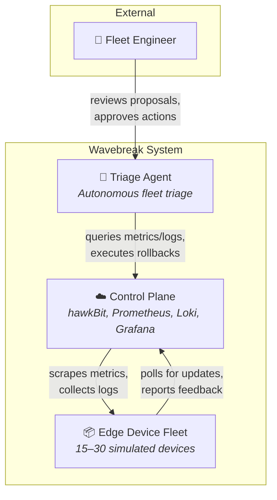
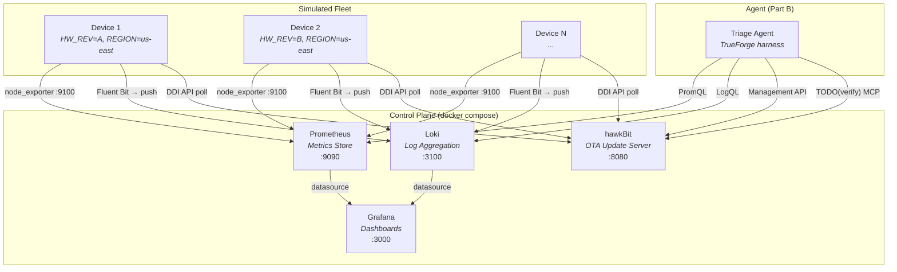
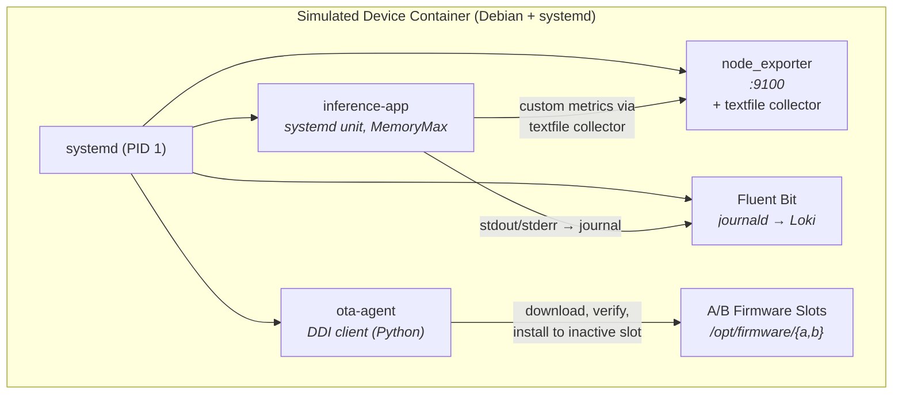
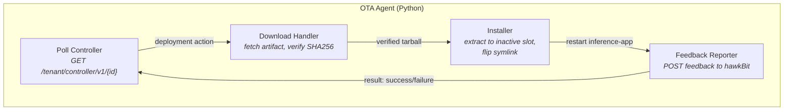
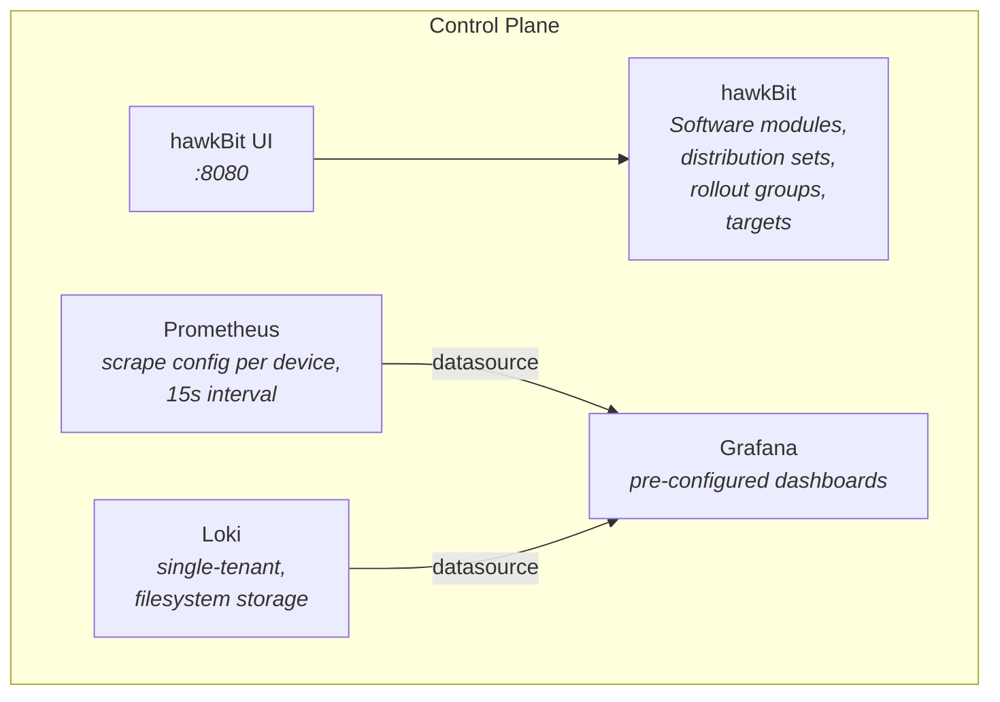
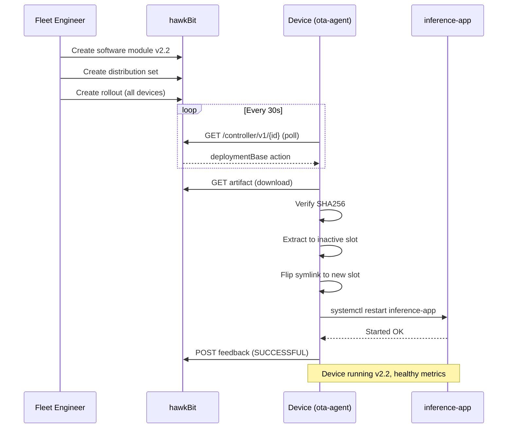
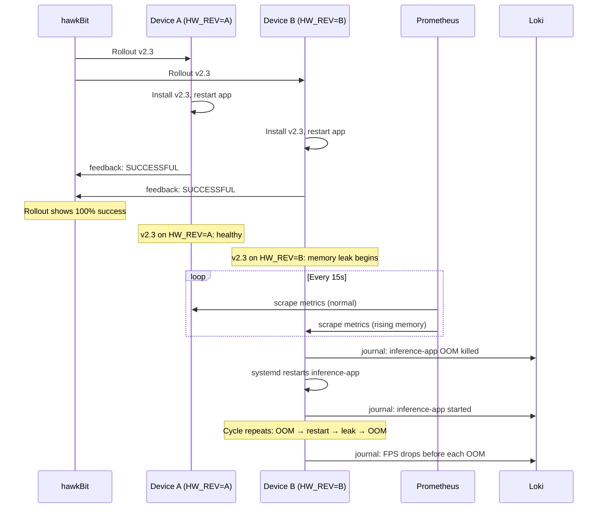
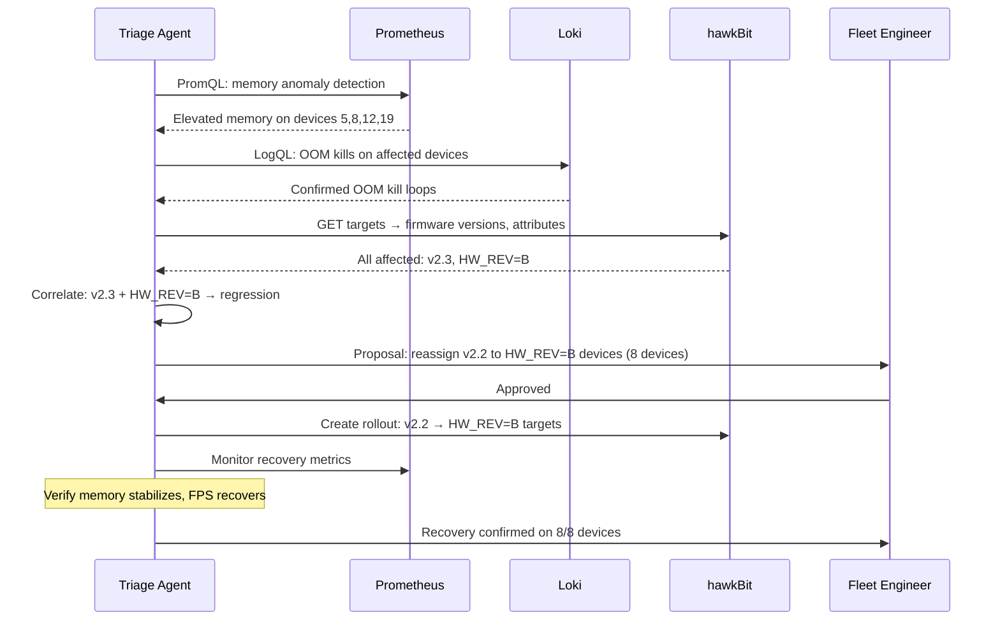

# Wavebreak — Architecture

## Table of Contents

- [0. Journey](#0-journey)
- [1. System Context (C4 L1)](#1-system-context-c4-l1)
- [2. Containers (C4 L2)](#2-containers-c4-l2)
- [3. Components (C4 L3)](#3-components-c4-l3)
  - [3.1 Simulated Device](#31-simulated-device)
  - [3.2 OTA Agent](#32-ota-agent)
  - [3.3 Control Plane](#33-control-plane)
- [4. Key Flows](#4-key-flows)
  - [4.1 Healthy OTA Update](#41-healthy-ota-update)
  - [4.2 Faulty Rollout → Runtime Failure](#42-faulty-rollout--runtime-failure)
  - [4.3 Agent Triage + Approval + Rollback](#43-agent-triage--approval--rollback)
- [5. Interfaces](#5-interfaces)
- [6. Data](#6-data)
- [7. Fault Scenarios](#7-fault-scenarios)
- [8. Deployment](#8-deployment)
- [9. Decisions Log](#9-decisions-log)
- [10. Open Questions / TODO(verify)](#10-open-questions--todoverify)
- [11. Part B — Agent](#11-part-b--agent)

---

## 0. Journey

**Pain point**: Firmware rollouts to edge AI device fleets "succeed" at install time but fail at runtime — memory leaks, OOM kill loops, FPS drops — often only on a subset of devices sharing a hardware revision or region. hawkBit's rollout thresholds only see install failures, so regressions spread silently. Engineers spend hours correlating metrics, logs, and rollout history across dozens of devices.

**Domain**: Linux-based edge AI devices (smart cameras, inference boxes) managed from a cloud backend. Real telemetry (Prometheus, Loki), real OTA (hawkBit).

**Why an agent**: The triage workflow is mechanical but wide — it crosses metrics, logs, rollout history, and device attributes. An agent can do the correlation in seconds, propose a scoped rollback, and wait for human approval before executing.

**What we built**: A production-faithful simulation of a 15–30 device fleet with real control-plane infrastructure (hawkBit, Prometheus, Loki, Grafana). The agent (Part B) operates on the same APIs a production agent would use.

---

## 1. System Context (C4 L1)



---

## 2. Containers (C4 L2)



---

## 3. Components (C4 L3)

### 3.1 Simulated Device



- **Identity**: env vars `DEVICE_ID`, `HW_REV` (A or B), `REGION` (us-east, eu-west, ap-south)
- **Firmware slots**: A/B layout under `/opt/firmware/`. Active slot symlinked at `/opt/firmware/current`.
- **inference-app**: fake workload; allocates memory proportional to firmware version behavior. v2.3 on HW_REV=B leaks memory until OOM-killed by systemd `MemoryMax`.

### 3.2 OTA Agent



- Speaks the real hawkBit DDI API.
- Reports `SUCCESSFUL` or `FAILURE` feedback after install.
- Does NOT detect runtime failures — that's the agent's job.

### 3.3 Control Plane



---

## 4. Key Flows

### 4.1 Healthy OTA Update



### 4.2 Faulty Rollout → Runtime Failure



### 4.3 Agent Triage + Approval + Rollback

> **Placeholder** — Part B implementation. Expected flow:



---

## 5. Interfaces

### hawkBit DDI API (device-facing)

| Endpoint | Method | Purpose |
|----------|--------|---------|
| `/tenant/controller/v1/{controllerId}` | GET | Poll for deployment actions |
| `/tenant/controller/v1/{controllerId}/deploymentBase/{actionId}` | GET | Get deployment details + artifacts |
| `/tenant/controller/v1/{controllerId}/deploymentBase/{actionId}/feedback` | POST | Report install result |
| `/tenant/controller/v1/{controllerId}/softwaremodules/{smId}/artifacts/{filename}` | GET | Download firmware artifact |

### hawkBit Management API (agent-facing)

| Endpoint | Method | Purpose |
|----------|--------|---------|
| `/rest/v1/targets` | GET/POST | List/create targets |
| `/rest/v1/targets/{id}` | GET | Get target details + attributes |
| `/rest/v1/softwaremodules` | GET/POST | List/create software modules |
| `/rest/v1/distributionsets` | GET/POST | List/create distribution sets |
| `/rest/v1/rollouts` | GET/POST | List/create rollouts |
| `/rest/v1/rollouts/{id}/start` | POST | Start a rollout |
| `/rest/v1/rollouts/{id}/pause` | POST | Pause a rollout |
| `/rest/v1/actions` | GET | List actions across targets |

### Prometheus

| Item | Value |
|------|-------|
| Port | 9090 |
| Scrape interval | 15s |
| Scrape targets | `device-{id}:9100/metrics` |
| Query API | `/api/v1/query`, `/api/v1/query_range` |

### Loki

| Item | Value |
|------|-------|
| Port | 3100 |
| Push endpoint | `POST /loki/api/v1/push` |
| Query API | `/loki/api/v1/query`, `/loki/api/v1/query_range` |
| Labels | `{device_id, hw_rev, region, job}` |

### Grafana

| Item | Value |
|------|-------|
| Port | 3000 |
| Default creds | admin / admin (via `.env`) |
| Datasources | Prometheus, Loki (provisioned) |

### hawkBit MCP Server

| Item | Value |
|------|-------|
| Status | TODO(verify): confirm MCP server ships in hawkBit Docker image |
| Tools | TODO(verify): list available MCP tools |
| Port | TODO(verify) |

---

## 6. Data

### Prometheus Metrics

| Metric | Source | Type | Description |
|--------|--------|------|-------------|
| `node_cpu_seconds_total` | node_exporter | counter | CPU usage |
| `node_memory_MemAvailable_bytes` | node_exporter | gauge | Available memory |
| `node_memory_MemTotal_bytes` | node_exporter | gauge | Total memory |
| `node_filesystem_avail_bytes` | node_exporter | gauge | Disk space |
| `node_network_receive_bytes_total` | node_exporter | counter | Network rx |
| `device_temperature_celsius` | textfile collector | gauge | Device temperature |
| `inference_fps` | textfile collector | gauge | Inference frames per second |
| `inference_app_memory_bytes` | textfile collector | gauge | App RSS memory |
| `gpu_memory_used_bytes` | textfile collector | gauge | GPU memory used |

### Loki Log Labels

| Label | Values | Description |
|-------|--------|-------------|
| `device_id` | `device-01` .. `device-30` | Device identifier |
| `hw_rev` | `A`, `B` | Hardware revision |
| `region` | `us-east`, `eu-west`, `ap-south` | Deployment region |
| `job` | `syslog`, `journal`, `kmsg` | Log source |

### Key Log Patterns

| Pattern | Meaning |
|---------|---------|
| `inference-app.*OOM` or `oom-kill` | OOM killer invoked |
| `inference-app.*started` | App (re)started |
| `inference-app.*memory.*bytes` | Memory usage log |
| `ota-agent.*install.*success` | Firmware installed |
| `ota-agent.*install.*failed` | Firmware install failed |
| `systemd.*reboot` | Device reboot |

### Device Identity Attributes

| Attribute | Source | Values |
|-----------|--------|--------|
| `DEVICE_ID` | env var | `device-01` through `device-30` |
| `HW_REV` | env var | `A`, `B` |
| `REGION` | env var | `us-east`, `eu-west`, `ap-south` |
| `firmware_version` | hawkBit target attributes | `v2.2`, `v2.3` |

---

## 7. Fault Scenarios

| ID | Trigger | Affected Cohort | Observable Symptoms | Expected Root Cause |
|----|---------|----------------|---------------------|---------------------|
| F1 | Rollout v2.3 | HW_REV=B only | Rising `inference_app_memory_bytes`, OOM kill logs, `inference_fps` drop to 0 before each kill, restart loops | Memory leak in v2.3 triggered by HW_REV=B-specific code path |
| F2 | (future) | TODO | TODO | TODO |
| F3 | (future) | TODO | TODO | TODO |

### F1 Timeline

1. **T+0**: v2.3 rollout starts, all devices install and report `SUCCESSFUL`
2. **T+2m**: HW_REV=B devices show rising `inference_app_memory_bytes`
3. **T+5m**: `inference_fps` drops on HW_REV=B devices as memory pressure increases
4. **T+8m**: First OOM kills on HW_REV=B devices; `inference_fps` = 0
5. **T+8m+**: systemd restarts app, leak resumes, cycle repeats every ~8 min
6. HW_REV=A devices remain healthy throughout

---

## 8. Deployment

### Local (Docker Compose)

| Requirement | Minimum |
|-------------|---------|
| Docker | 24+ |
| Docker Compose | v2.20+ |
| RAM | 8 GB (16 GB recommended for 30 devices) |
| Disk | 10 GB free |
| CPU | 4 cores |

```bash
cp .env.example .env
make up      # control plane
make fleet   # devices
```

### AWS (Single EC2)

| Item | Value |
|------|-------|
| Instance type | `t3.xlarge` (4 vCPU, 16 GB) or `t4g.xlarge` (ARM) |
| AMI | Amazon Linux 2023 or Ubuntu 22.04 |
| Disk | 30 GB gp3 |
| Security groups | 22 (SSH), 8080 (hawkBit UI), 3000 (Grafana), 9090 (Prometheus) |
| Bootstrap | `bash infra/aws/bootstrap.sh` |

Bootstrap steps:
1. Install Docker + Compose
2. Clone repo
3. Copy `.env`
4. `make up && make fleet`

Optional: one Graviton (`t4g.medium`) running the device install natively for ARM credibility.

---

## 9. Decisions Log

| ID | Decision | Reason | Date |
|----|----------|--------|------|
| D1 | Use real hawkBit instead of mocking OTA | Judges want production-like behavior; hawkBit is OSS and has Docker images | 2026-09-26 |
| D2 | Debian + systemd containers for devices | Need systemd for journal, service management, OOM control (MemoryMax); Alpine lacks systemd | 2026-09-26 |
| D3 | Fluent Bit over Promtail for log shipping | Lighter footprint per container; native journald input plugin | 2026-09-26 |
| D4 | A/B firmware slot design | Mirrors real edge device layout; enables clean rollback semantics | 2026-09-26 |
| D5 | Real memory leak for fault injection | "Faults are real code behaving badly, never fabricated log lines" — more convincing to judges | 2026-09-26 |
| D6 | Mermaid flowcharts styled as C4 over native C4 syntax | Mermaid C4 syntax is experimental and renders unreliably across tools | 2026-09-26 |
| D7 | Single architecture.md as design source of truth | One file to maintain; HTML viewer is derived, never hand-edited | 2026-09-26 |

---

## 10. Open Questions / TODO(verify)

| # | Question | Status |
|---|----------|--------|
| Q1 | Does the hawkBit Docker image ship an MCP server? What tools does it expose? | TODO(verify) |
| Q2 | Exact TrueForge API / harness structure for agent integration | TODO(verify) — do not invent |
| Q3 | TrueFoundry LLM gateway configuration and supported models | TODO(verify) |
| Q4 | hawkBit DDI polling interval — configurable per target or global? | TODO(verify) |
| Q5 | Can systemd run as PID 1 in a Docker container without `--privileged`? Likely needs `--cap-add SYS_ADMIN` or `--cgroupns=host` | TODO(verify) |
| Q6 | AWS credits scope — which services, limits? | TODO(verify) |
| Q7 | Fluent Bit journald input: does it work when systemd is PID 1 in container? | TODO(verify) |
| Q8 | hawkBit artifact storage: local filesystem or need MinIO/S3? | TODO(verify) |

---

## 11. Part B — Agent

> Placeholder for hackathon build day.

- **Name**: Edge Fleet Triage Agent
- **Harness**: TrueForge (TODO(verify) API details)
- **Hosting**: TrueFoundry
- **Capabilities**: PromQL queries, LogQL queries, hawkBit Management API, sandbox device spawning
- **Approval gate**: required before any hawkBit write operation (rollout create, target assignment)
- **Details**: TBD during Part B
