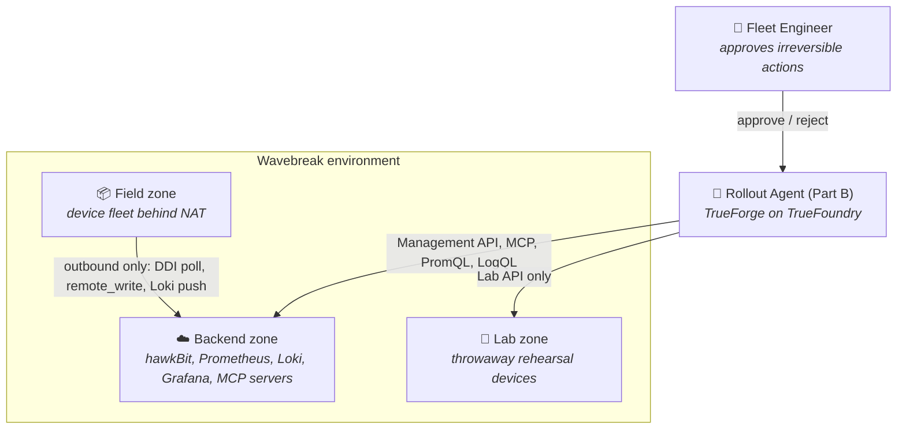
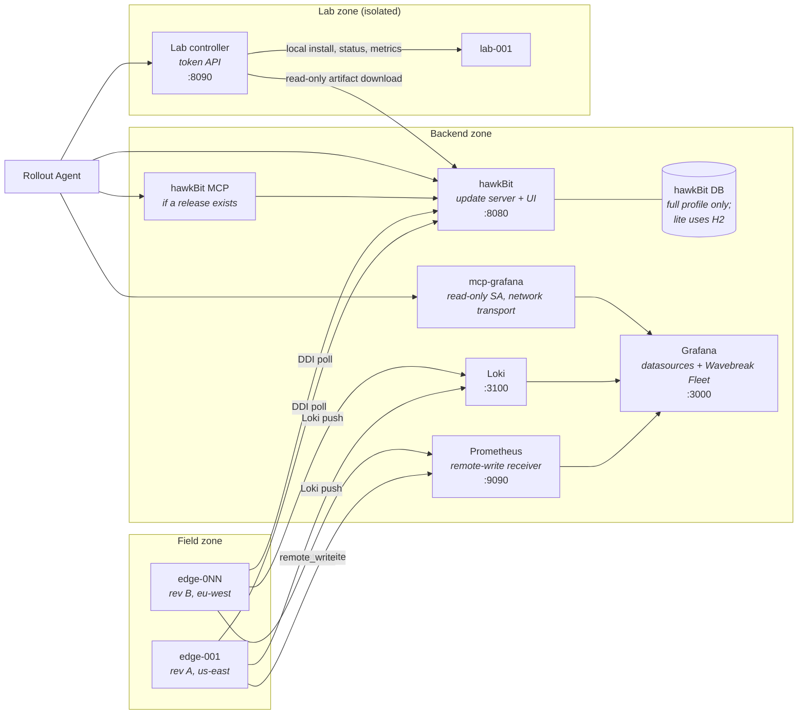
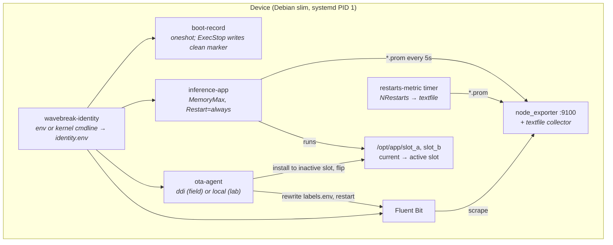
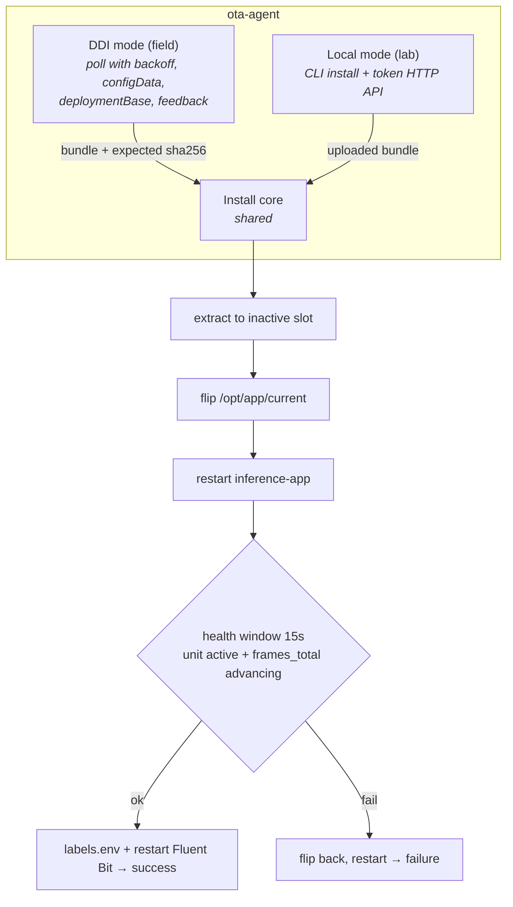
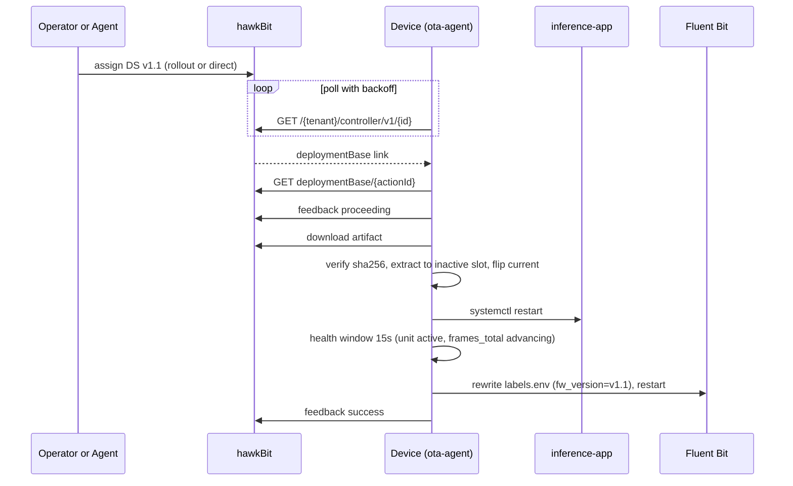
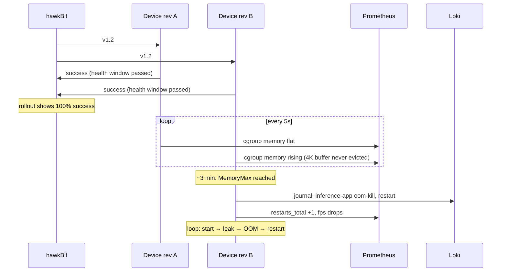
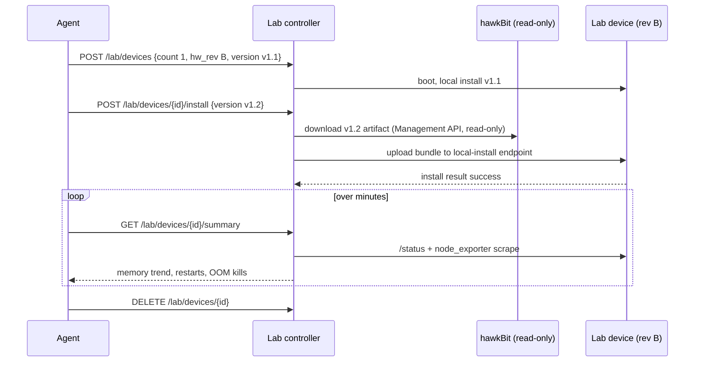
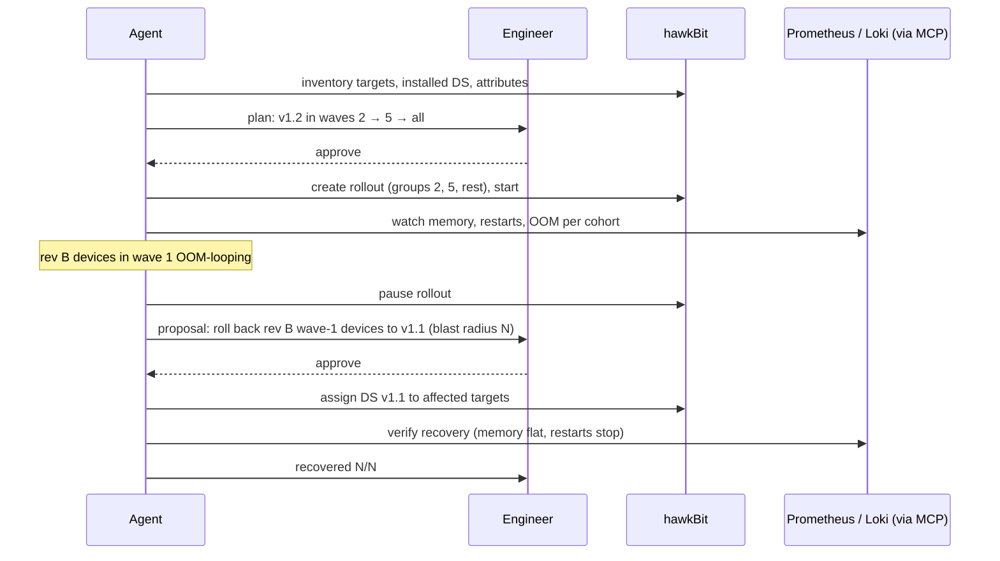

# Wavebreak — Architecture

> Wavebreak catches bad OTA rollouts at runtime and rolls them back, with your approval.

## Table of Contents

- [0. Journey](#0-journey)
- [1. System Context (C4 L1)](#1-system-context-c4-l1)
- [2. Containers (C4 L2)](#2-containers-c4-l2)
- [3. Components (C4 L3)](#3-components-c4-l3)
  - [3.1 Simulated Device](#31-simulated-device)
  - [3.2 OTA Agent](#32-ota-agent)
  - [3.3 inference-app and Releases](#33-inference-app-and-releases)
  - [3.4 Rehearsal Lab](#34-rehearsal-lab)
  - [3.5 Backend](#35-backend)
  - [3.6 Runtimes](#36-runtimes)
- [4. Key Flows](#4-key-flows)
  - [4.1 Healthy OTA Update](#41-healthy-ota-update)
  - [4.2 Faulty Rollout → Runtime Failure](#42-faulty-rollout--runtime-failure)
  - [4.3 Rehearsal in the Lab](#43-rehearsal-in-the-lab)
  - [4.4 Canary Waves, Halt and Rollback](#44-canary-waves-halt-and-rollback)
- [5. Interfaces](#5-interfaces)
- [6. Data](#6-data)
- [7. Fault Catalogue](#7-fault-catalogue)
- [8. Deployment](#8-deployment)
- [9. Decisions Log](#9-decisions-log)
- [10. Open Questions / TODO(verify)](#10-open-questions--todoverify)
- [11. Part B — Agent](#11-part-b--agent)
- [12. Runbook](#12-runbook)

---

## 0. Journey

**Pain point**: a firmware rollout to an edge AI fleet "succeeds" (install OK), then fails at runtime — memory leak → OOM kill loop, config crash loop, FPS drop — often only on a subset (hardware revision, region). hawkBit rollout thresholds only count install failures, so the regression spreads. Humans spend hours correlating metrics, logs, and rollout history.

**Domain**: Linux edge AI devices (smart cameras) managed from a cloud backend. Real telemetry (Prometheus, Loki), real OTA (Eclipse hawkBit).

**Why an agent**: the rollout-manager job is mechanical but wide. An agent can inventory versions, rehearse an update on throwaway devices, run canary waves, read metrics and logs between waves, and propose promote / halt / rollback — stopping for human approval before anything irreversible.

**What Part A builds** (this document): a production-faithful environment. Control plane and protocols are real; only device hardware and the payload are simulated. Faults are real code misbehaving, never fabricated log lines.

---

## 1. System Context (C4 L1)

- The agent never touches devices directly. Field devices are reached only through hawkBit; lab devices only through the lab controller API.

---

## 2. Containers (C4 L2)

---

## 3. Components (C4 L3)

### 3.1 Simulated Device

One image (`sim/device/Dockerfile`), two runtimes (container, Firecracker).

| Item | Value |
|------|-------|
| Identity | `DEVICE_ID`, `HW_REV` (A or B), `REGION`. Container: env. Firecracker: `wavebreak.device_id=`, `wavebreak.hw_rev=`, `wavebreak.region=` kernel args. First-boot unit writes `/etc/wavebreak/identity.env` |
| Labels file | `/etc/wavebreak/labels.env`: device_id, hw_rev, region, fw_version. Rewritten by ota-agent after each install |
| App slots | `/opt/app/slot_a`, `/opt/app/slot_b`, symlink `/opt/app/current` |
| MemoryMax | lite 48M, full 96M (from fleet profile) |
| boot-record | appends `{boot_id, ts, fw_version, previous_shutdown: clean or unclean}` to `/var/log/wavebreak/boot.log`. Containers generate `boot_id` per start (kernel boot_id is the host's) |
| kmsg | Firecracker only. In containers `/dev/kmsg` is the host's, so the input is disabled |

### 3.2 OTA Agent

Python stdlib only (`sim/ota-agent`), pytest tests.

- DDI: registers config data (device_id, hw_rev, region, fw_version); verifies the artifact against hawkBit's sha256; feedback `proceeding` → `success` or `failure` with messages.
- Assigned version == installed version → report success without reinstalling (makes seeding work).
- The health window is intentionally short: v1.3 fails after it closes (see §7), which is the point.
- Auth: DDI gateway token (D14).

### 3.3 inference-app and Releases

Simulated camera-AI loop: generates frames sized by sensor (rev A "1080p", rev B "4K"; bytes scaled down, configurable), "processes" them, logs JSON lines (with fw_version and labels), writes textfile metrics every 5 s, reloads config every ~45 s.

| Release | Change | Behaviour |
|---------|--------|-----------|
| v1.0 | baseline | healthy |
| v1.1 | adds per-frame latency metric | healthy |
| v1.2 | adds a "4K enhancement buffer", used only when sensor is 4K; never evicted | rev B: memory climbs to MemoryMax → OOM kill → restart loop (~3 min, configurable). Rev A unaffected |
| v1.3 | renames a config key without migration | first config reload (~45 s, after the health window) raises → crash loop on every device; hawkBit shows install success |
| v1.4 | bounded 4K buffer | fixes v1.2 |

Bundle layout: `sim/bundles/vX.Y/{manifest.json, app/, config.yaml}` → `build/bundles/wavebreak-app-vX.Y.tar` + `.sha256`.

### 3.4 Rehearsal Lab

- `lab/controller` (FastAPI, token auth). The agent gets only this API: no Docker socket, no root. The controller alone mounts the Docker socket.
- Boots throwaway devices at a requested revision and version, installs a candidate fetched **read-only** from hawkBit's Management API, and reports a summary read directly from the device (ota-agent `/status` + node_exporter scrape).
- Isolation: container runtime → internal Docker network `wavebreak_lab` with no route to the backend; the controller attaches to `backend` and `wavebreak_lab`. Firecracker → `wblab0` bridge without NAT or forwarding.
- Lab devices never talk to production hawkBit, Prometheus, or Loki (ota-agent in local mode, Fluent Bit outputs disabled).

### 3.5 Backend

| Service | Role | Notes |
|---------|------|-------|
| hawkBit update server | DDI + Management API | `hawkbit/hawkbit-update-server:1.1.0`; lite: file-backed H2 in artifact volume, heap capped. full: MySQL |
| hawkBit UI | Optional browser UI, separate image | `hawkbit/hawkbit-ui:1.1.0`; full profile enables it, lite requires `HAWKBIT_UI=1`; UI calls the server Management API |
| Prometheus | metrics | `--web.enable-remote-write-receiver`; devices push |
| Loki | logs | single binary, filesystem storage |
| Grafana | dashboards | provisioned datasources + "Wavebreak Fleet" dashboard |
| mcp-grafana | agent tool server | official Grafana MCP, read-only service account, network transport |
| hawkBit MCP | agent tool server | `hawkbit-mcp-server` jar from Maven Central, run on the hawkBit image's JRE; streamable HTTP, port 8082 |

### 3.6 Runtimes

| | container | firecracker |
|--|-----------|-------------|
| Isolation | systemd container | microVM (KVM) |
| Flags / setup | `--cgroupns=host -v /sys/fs/cgroup:/sys/fs/cgroup:rw --tmpfs /run --tmpfs /run/lock`, STOPSIGNAL SIGRTMIN+3 | `scripts/host/setup-fc-net.sh` once (sudo), then rootless |
| Rootfs | the image | image → `docker export` → `fakeroot mkfs.ext4 -d` → per-VM reflink/sparse copy |
| Kernel | host | Firecracker CI guest kernel 6.1 |
| Field network | Docker network `wb-field` | bridge `wbfield0` 172.30.0.0/24 + NAT; backend at 172.30.0.1 (host-published ports) |
| Lab network | Docker internal network `wb-lab` | bridge `wblab0` 172.31.0.0/24, no NAT |
| Memory per device | MemoryMax only | VM 128 MB lite, 256 MB full |
| kmsg input | off | on |
| Per-device files | — | `run/fc/<id>/` config JSON, API socket, serial log, pidfile |

Fleet: `sim/fleet/fleet.yaml` profiles lite (4 devices) and full (20); hw_rev 60% A / 40% B; regions us-east, eu-west, ap-south; deterministic IDs `edge-001`…; initial version v1.0.

---

## 4. Key Flows

### 4.1 Healthy OTA Update

### 4.2 Faulty Rollout → Runtime Failure

### 4.3 Rehearsal in the Lab

### 4.4 Canary Waves, Halt and Rollback

Executed by the Part B agent; documented here as the target behaviour.

---

## 5. Interfaces

Endpoint facts below come from hawkBit docs and are **TODO(verify)** against the running server's OpenAPI (T2.1, S1) unless marked verified.

hawkBit server facts (T2.1; image inspected, rest read from docs):

| Item | Value |
|------|-------|
| Image | `hawkbit/hawkbit-update-server:1.1.0` (monolith: UI, DDI, Management API; `PROFILES=h2` default). Split images `hawkbit-ddi-server`, `hawkbit-mgmt-server` exist; not used |
| Heap | entrypoint uses `X_MS`, `X_MX`, `XX_MAX_METASPACE_SIZE`, `XX_METASPACE_SIZE`, `JAVA_OPTS` env (defaults 768m heap, 250m metaspace) |
| DB (full) | official compose `docker/mysql/docker-compose-monolith-mysql.yml`: `PROFILES=mysql`, `SPRING_DATASOURCE_URL`, `SPRING_DATASOURCE_USERNAME`, `SPRING_DATASOURCE_PASSWORD` |
| Users | default admin/admin; lab uses `hawkbit.security.user.lab.{tenant,password,permissions}` with target, distribution-set, and software-module read authorities |
| Tenant | `DEFAULT` |
| Tenant configs | `PUT /rest/v1/system/configs/{key}` body `{"value": ...}`; keys `authentication.gatewaytoken.enabled`, `authentication.gatewaytoken.key`, `authentication.targettoken.enabled`, `pollingTime` (`HH:MM:SS`) |
| Artifacts | `org.eclipse.hawkbit.repository.file.path` (default `./artifactrepo`, i.e. `/app/artifactrepo`) |
| OpenAPI | `http://<host>:8080/swagger-ui/index.html`, JSON `/v3/api-docs` (verified; no `/actuator/health`, image has no curl) |
| Users (verified) | `-Dhawkbit.security.user.<name>.{tenant,password,roles,permissions}`; password `{noop}...`. Lab can list software modules and download artifacts; target creation returns 403 |
| Polling (verified) | tenant `pollingTime` min is 30s unless `-Dhawkbit.controller.minPollingTime=00:00:05`; tenant config path is `/rest/v1/system/configs/{key}` |

hawkBit MCP server (T2.2): standalone Spring Boot jar `org.eclipse.hawkbit:hawkbit-mcp-server:1.1.0` on Maven Central (54 MB, no build needed). Runs on the JRE of the hawkBit image (`java -jar`). Properties: `server.port=8081`, `spring.ai.mcp.server.protocol=STREAMABLE` (path `/mcp`, TODO(verify) S1), `hawkbit.mcp.mgmt-url=${HAWKBIT_URL}`. Clients send their own hawkBit credentials as `Authorization: Basic ...`; the server validates them against hawkBit and forwards. Operation switches: `hawkbit.mcp.operations.delete-enabled`, `hawkbit.mcp.operations.rollouts.start-enabled`, `...approve-enabled`. Tools cover targets, target filters, software modules, distribution sets, rollouts (create/start/pause/resume/stop/approve/deny/retry/trigger-next-group), actions.

### hawkBit DDI API (device-facing)

| Endpoint | Method | Purpose |
|----------|--------|---------|
| `/{tenant}/controller/v1/{controllerId}` | GET | Poll; returns links and polling sleep |
| `/{tenant}/controller/v1/{controllerId}/configData` | PUT | Send attributes (device_id, hw_rev, region, fw_version) |
| `/{tenant}/controller/v1/{controllerId}/deploymentBase/{actionId}` | GET | Deployment details, chunks, artifact links and hashes |
| `/{tenant}/controller/v1/{controllerId}/deploymentBase/{actionId}/feedback` | POST | Report proceeding / success / failure |
| `/{tenant}/controller/v1/{controllerId}/softwaremodules/{smId}/artifacts/{filename}` | GET | Download artifact |

Auth header: `Authorization: GatewayToken <token>` (or `TargetToken <token>`), behind a config flag.

### hawkBit Management API (agent, publish, seed, lab controller)

| Endpoint | Method | Purpose |
|----------|--------|---------|
| `/rest/v1/targets` | GET | List targets (FIQL `q=`) |
| `/rest/v1/targets/{id}/attributes` | GET | Target attributes |
| `/rest/v1/targets/{id}/installedDS` | GET | Installed distribution set |
| `/rest/v1/targets/{id}/assignedDS` | POST | Assign DS to a target |
| `/rest/v1/targets/{id}/actions/{actionId}` | GET | Action status |
| `/rest/v1/softwaremoduletypes`, `/rest/v1/distributionsettypes` | GET | Discover types at runtime |
| `/rest/v1/softwaremodules` | GET, POST | List / create SM (body `type` is the type KEY, e.g. `application`; verified) |
| `/rest/v1/softwaremodules/{id}/artifacts` | POST | Upload artifact (multipart) |
| `/rest/v1/softwaremodules/{id}/artifacts/{artifactId}/download` | GET | Download artifact (lab controller, read-only) |
| `/rest/v1/distributionsets` | GET, POST | List / create DS |
| `/rest/v1/distributionsets/{id}/assignedTargets` | POST | Assign DS to targets |
| `/rest/v1/rollouts` | GET, POST | List / create rollout (targetFilterQuery, amountGroups or groups, success/error conditions) |
| `/rest/v1/rollouts/{id}/start`, `/pause`, `/resume` | POST | Control rollout |
| `/rest/v1/rollouts/{id}/deploygroups` | GET | Group status |
| `/rest/v1/system/configs/{key}` | PUT | Tenant config (gateway token, polling); verified |

Auth: HTTP basic (user from `.env`).

Canary waves are separate hawkBit rollouts. `HawkbitClient.create_wave()` creates one rollout with `amountGroups: 1` and leaves it unstarted; `start_rollout()` is a separate call after approval. The next wave is another create call with its own target filter, so success in one wave cannot start the next wave.

### ota-agent local API (lab devices only)

| Endpoint | Method | Purpose |
|----------|--------|---------|
| `/install` | POST | Raw tar body, optional `X-Sha256` header; 200 ok or 422 failed, body = install result |
| `/status` | GET | fw_version, slot, unit state, restarts, last install result |

Auth: `Authorization: Bearer <LAB_DEVICE_TOKEN>`. Port 8081.

### Lab controller API (agent-facing)

| Endpoint | Method | Purpose |
|----------|--------|---------|
| `/lab/devices` | POST | `{count, hw_rev, version}` → boot lab devices at a version |
| `/lab/devices` | GET | List lab devices |
| `/lab/devices/{id}/install` | POST | `{version}` → fetch artifact from hawkBit (read-only), upload to device |
| `/lab/devices/{id}/summary` | GET | fw_version, memory trend samples, restarts, OOM kills, unit state, last install result |
| `/lab/devices/{id}` | DELETE | Destroy device |

Auth: `Authorization: Bearer <LAB_API_TOKEN>`. Port 8090.

### Telemetry ingest (device → backend)

| Path | Protocol | Target |
|------|----------|--------|
| Metrics | Prometheus remote_write | `http://<backend>:9090/api/v1/write` |
| Logs | Loki push | `http://<backend>:3100/loki/api/v1/push` |

### Fluent Bit pipeline (T6.1; docs read, options confirmed via `--help` of fluent/fluent-bit 5.1.2)

Install on Debian bookworm: apt repo `https://packages.fluentbit.io/debian/bookworm bookworm main`, key `https://packages.fluentbit.io/fluentbit.key`, package `fluent-bit`, binary `/opt/fluent-bit/bin/fluent-bit`. Config validation: `fluent-bit --dry-run -c <file>` (property names validated since 4.2).

| Stage | Plugin | Config |
|-------|--------|--------|
| input | `prometheus_scrape` | `host 127.0.0.1`, `port 9100`, `metrics_path /metrics`, `scrape_interval 15s` |
| input | `systemd` | `systemd_filter _SYSTEMD_UNIT=inference-app.service` (one line per unit), `systemd_filter_type or`, `read_from_tail on`, `strip_underscores on`, `lowercase on`, `db` |
| input | `kmsg` | Firecracker only (`prio_level`) |
| input | `tail` | `path /var/log/wavebreak/boot.log`, `parser json`, `db` |
| filter | `record_modifier` | `record source journal` etc. per input tag |
| output | `prometheus_remote_write` | `host`, `port 9090`, `uri /api/v1/write`, `add_label device_id ${DEVICE_ID}` (repeatable), `retry_limit` |
| output | `loki` | `labels device_id=${DEVICE_ID}, hw_rev=${HW_REV}, region=${REGION}, fw_version=${FW_VERSION}, $source`, `line_format json` |

Labels come from `/etc/wavebreak/labels.env` via the unit's `EnvironmentFile`; `${VAR}` is substituted when the config is loaded, so ota-agent restarts Fluent Bit after rewriting the file. TODO(verify) T6.5: env substitution inside the loki `labels` value (docs only show it generically).

### Ports

| Port | Service |
|------|---------|
| 8080 | hawkBit DDI + Management API |
| 8081 | hawkBit UI (optional; UI container port 8080) |
| 9090 | Prometheus |
| 3100 | Loki |
| 3000 | Grafana |
| 8082 | hawkBit MCP (container 8081, `/mcp`) |
| 8000 | mcp-grafana (`-t streamable-http`, path `/mcp`) |
| 8090 | Lab controller |
| 8081 | ota-agent local API (inside each lab device container) |
| 9100 | node_exporter (device-local) |

---

## 6. Data

### Device metrics (textfile collector; source of truth for memory in both runtimes)

In containers node_exporter reports **host** memory, so app-level and cgroup metrics are authoritative.

| Metric | Type | Description |
|--------|------|-------------|
| `wavebreak_app_info{fw_version}` | gauge (1) | Running version, for joins |
| `wavebreak_app_rss_bytes` | gauge | App RSS |
| `wavebreak_app_cgroup_memory_bytes` | gauge | Unit cgroup `memory.current` |
| `wavebreak_app_frames_total` | counter | Frames processed; heartbeat for the health window |
| `wavebreak_app_fps` | gauge | Frames per second |
| `wavebreak_app_cache_items` | gauge | Items in the enhancement buffer / cache |
| `wavebreak_app_frame_latency_seconds` | gauge | Per-frame latency (v1.1+) |
| `wavebreak_app_restarts_total` | counter | systemd NRestarts (timer unit) |
| `wavebreak_device_boot_time_seconds` | gauge | Boot timestamp |

Every series carries `device_id`, `hw_rev`, `region`, `fw_version` (added by Fluent Bit from labels.env).

### Log streams (Loki)

| Label | Values |
|-------|--------|
| `device_id` | `edge-001` … `edge-020`, `lab-NNN` |
| `hw_rev` | `A`, `B` |
| `region` | `us-east`, `eu-west`, `ap-south` |
| `fw_version` | `v1.0` … `v1.4` |
| `source` | `journal`, `kmsg`, `boot` |

### Key log patterns

| Pattern | Meaning |
|---------|---------|
| `inference-app.service: A process of this unit has been killed by the OOM killer` / `Failed with result 'oom-kill'` | OOM kill (systemd wording, TODO(verify) exact text) |
| app JSON `"event": "config_reload_failed"` then traceback | v1.3 crash |
| ota-agent JSON `"event": "install_result"` | install success or failure |
| boot.log `"previous_shutdown": "unclean"` | crash or power loss before this boot |

### Device attributes in hawkBit (configData)

| Attribute | Values |
|-----------|--------|
| `device_id` | `edge-001` … |
| `hw_rev` | `A`, `B` |
| `region` | `us-east`, `eu-west`, `ap-south` |
| `fw_version` | installed version |

---

## 7. Fault Catalogue

| ID | Release | Cohort | Symptoms | Root cause (real code) |
|----|---------|--------|----------|------------------------|
| F1 | v1.2 | HW_REV=B | cgroup memory climbs, fps drops, OOM kill ~3 min after install, restart loop, restarts_total rising | 4K enhancement buffer never evicted |
| F2 | v1.3 | all devices | install success, then crash ~45 s after start on every restart, restarts_total rising, fps 0 | config key renamed without migration, read on first reload |
| — | v1.4 | — | healthy | F1 fixed with bounded buffer |

### F1 timeline

1. T+0: v1.2 installed, health window passes, hawkBit shows success.
2. T+0…3m: rev B `wavebreak_app_cgroup_memory_bytes` climbs; rev A flat.
3. T+~3m: OOM kill at MemoryMax; systemd restarts the app; cycle repeats.

### F2 timeline

1. T+0: v1.3 installed; health window (15 s) passes.
2. T+~45s: first config reload raises; systemd restarts; repeats on every device.

---

## 8. Deployment

| | Local (WSL, dev) | AWS (build day) |
|--|------------------|-----------------|
| Profile | lite (4 devices, H2) | full (20 devices, hawkBit DB) |
| Runtime | container; Firecracker for one-VM smoke | firecracker (fallback container if no `/dev/kvm`) |
| Host | 3.5 GB RAM, 8 vCPU, KVM available | `m8i.2xlarge`, nested virtualization via `--cpu-options NestedVirtualization=enabled` (AWS CLI >= 2.36), Ubuntu 24.04, 60 GB gp3 |
| Access | localhost | SG restricted to caller IP: 22, 3000, 8080, MCP, 8090 |
| Bootstrap | Makefile targets | `infra/aws/launch.sh` → user-data → `infra/aws/install.sh` |

Make targets (PROFILE=lite or full, RUNTIME=container or firecracker): `up`, `down`, `bundles`, `publish`, `fleet`, `fleet-down`, `seed`, `lab`, `view`, `test`, `lint`, `smoke-<component>`, `all`.

---

## 9. Decisions Log

| ID | Decision | Reason | Date |
|----|----------|--------|------|
| D1 | Real hawkBit, not a mock | Production-like behaviour; OSS with Docker images | 2026-09-25 |
| D2 | Debian + systemd devices | journald, unit management, MemoryMax / OOM semantics | 2026-09-25 |
| D3 | Fluent Bit on devices | One lightweight agent for metrics (remote_write) and logs (Loki); journald input | 2026-09-25 |
| D4 | A/B **app** slots under `/opt/app` (supersedes rootfs slots) | Clean rollback semantics without rebuilding rootfs; same layout in both runtimes | 2026-09-25 |
| D5 | Faults are real code diffs | Symptoms emerge from processes misbehaving, never fabricated logs | 2026-09-25 |
| D6 | Mermaid flowcharts styled as C4 | Mermaid C4 syntax renders unreliably | 2026-09-25 |
| D7 | architecture.md is the single design source; HTML is generated | One file to maintain | 2026-09-25 |
| D8 | Three zones: backend, field, lab | Mirrors production: devices behind NAT, isolated rehearsal | 2026-09-25 |
| D9 | Devices push telemetry (remote_write, Loki push); no Prometheus scraping of devices (supersedes scrape design) | Real devices are behind NAT and only initiate outbound connections | 2026-09-25 |
| D10 | Releases v1.0–v1.4 as app bundles (supersedes v2.2 / v2.3) | Two independent faults (F1 cohort leak, F2 fleet-wide crash) plus a fix release | 2026-09-25 |
| D11 | App-level + cgroup metrics are the memory source of truth | node_exporter in containers reports host memory | 2026-09-25 |
| D12 | systemd containers run with `--cgroupns=host -v /sys/fs/cgroup:/sys/fs/cgroup:rw --tmpfs /run --tmpfs /run/lock`, **not** privileged | Verified in WSL (run 1): reaches `running`, MemoryMax enforced in nested cgroup. `--cgroupns=private` without the mount fails to boot | 2026-09-25 |
| D13 | Firecracker guest kernel from CI bucket: newest `firecracker-ci/vX.Y/<arch>/vmlinux-6.1.*` that exists | Verified run 1: v1.17.0 binary; v1.16 and v1.17 CI prefixes have no kernel; v1.15 has 6.1.155, boots under KVM in WSL | 2026-09-25 |
| D14 | DDI auth via gateway token | One token for the simulation; production would use per-device target tokens or mTLS. Target-token mode kept behind a flag | 2026-09-25 |
| D15 | Rootless rootfs build: `docker export` + `fakeroot mkfs.ext4 -d` | No sudo needed; e2fsprogs 1.47 supports `-d` | 2026-09-25 |
| D16 | Lab controller: compose service on backend + lab networks (container runtime); host process (Firecracker runtime, needs taps and KVM) | Agent gets only the token API in both cases | 2026-09-25 |
| D17 | Device-side Python is stdlib only | Small image, no pip in rootfs | 2026-09-25 |
| D18 | Part A is built by an overnight headless Claude loop with cheap subagents | Save build-day tokens for the agent | 2026-09-25 |
| D19 | hawkBit MCP runs the Maven Central jar on the hawkBit image's JRE (fetched by `scripts/fetch-hawkbit-mcp.sh` into `build/`) | No official image; no local Maven build (RAM) | 2026-09-25 |
| D20 | Release source lives in `sim/bundles/vX.Y/` (full copies); `sim/inference-app/` holds the shared tests | Releases must be real, diffable code; bundles are what hawkBit ships | 2026-09-25 |
| D22 | Lite hawkBit uses file-backed H2 at `/app/artifactrepo/hawkbit-h2` with `MODE=LEGACY`; database and artifacts persist in the `hawkbit-artifacts` volume | hawkBit's image-default H2 state had no database file and disappeared with container recreation. H2 2.x also needs legacy mode for hawkBit's `CALL IDENTITY()` sequence query | 2026-09-26 |
| D21 | Rev B assignment: device i is B iff ceil(0.4 i) > ceil(0.4 (i-1)) | Deterministic, evenly spread; edge-001 is B so a 2-device canary wave includes rev B | 2026-09-25 |
| D23 | If lite hawkBit's persistent volume is intentionally removed, run `make publish` to recreate release data and `make seed` to align registered devices | The idempotent publisher restored v1.0–v1.4 after the original ephemeral database was lost | 2026-09-26 |
| D24 | Device identity setup creates temporary files under `/run/wavebreak` and removes them with an exit trap | The `/tmp` file was missing during an early systemd boot; moving both files into the unit's runtime directory made identity initialization reliable | 2026-09-26 |
| D25 | Fleet `frame_scale` is passed as `WAVEBREAK_FRAME_SCALE` into the device environment | Lets the profile control simulated frame allocation rate; identity setup must preserve the exact app variable name | 2026-09-26 |
| D26 | E2E restart checks take the maximum over matching Prometheus series and scope the baseline to the installed firmware version | Remote-write retains series across firmware label changes and older versions can remain visible | 2026-09-26 |
| D27 | Lab controller fetches bundles with a dedicated hawkBit user granted `READ_TARGET`, `READ_DISTRIBUTION_SET`, `READ_DISTRIBUTION_SET_TYPE`, `READ_SOFTWARE_MODULE`, `READ_SOFTWARE_MODULE_TYPE`, and `READ_SOFTWARE_MODULE_ARTIFACT` | Lab rehearsal must download releases without Management API write access; verified read endpoints return 200 and target creation returns 403 | 2026-09-26 |

---

## 10. Open Questions / TODO(verify)

| # | Question | Status |
|---|----------|--------|
| Q1 | hawkBit MCP server: released image? transport, port, tools | **Resolved** T2.2: jar on Maven Central, streamable HTTP, port 8081 (host 8082), see §5 |
| Q2 | TrueForge API and harness structure | TODO(verify) build day — do not invent |
| Q3 | TrueFoundry LLM gateway config and models | TODO(verify) build day |
| Q4 | hawkBit polling interval config (tenant-wide `pollingTime`?) | **Resolved** T2.1 (docs): tenant config `pollingTime` `HH:MM:SS` |
| Q5 | systemd as PID 1 in Docker without privileged | **Resolved** D12 |
| Q6 | AWS credits scope and limits | TODO(verify) build day |
| Q7 | Fluent Bit journald input in a systemd container | TODO(verify) T6.5 |
| Q8 | hawkBit artifact storage (local FS in container?) | **Resolved** T2.1: `/app/artifactrepo` (property `org.eclipse.hawkbit.repository.file.path`); volume in compose |
| Q9 | Current hawkBit image names (monolith vs split DDI/Mgmt images) | **Resolved** T2.1: monolith `hawkbit/hawkbit-update-server:1.1.0` |
| Q10 | Fluent Bit `prometheus_remote_write` output: supports adding static labels? | **Resolved** T6.1: `add_label <name> <value>`, repeatable |
| Q11 | mcp-grafana network transport flag and port | **Resolved** T10.3: image `grafana/mcp-grafana`, `-t streamable-http -address 0.0.0.0:8000`, path `/mcp`, env `GRAFANA_URL`, `GRAFANA_SERVICE_ACCOUNT_TOKEN`, `--disable-write`; optional `MCP_GRAFANA_SERVER_TOKEN` for caller auth |
| Q12 | Read-only hawkBit user for the lab controller (permission config) | **Resolved** T9.3: lab user reads bundle metadata and artifact download; target creation returns 403. Use granular authorities in D27 |
| Q13 | Can the host reach containers on a Docker `internal: true` network | TODO(verify) T9.2 |
| Q14 | AWS CLI syntax for nested virtualization on M8i | **Resolved** T12.1 (docs read): `aws ec2 run-instances --cpu-options NestedVirtualization=enabled`, AWS CLI v2 >= 2.36; AMI `resolve:ssm:/aws/service/canonical/ubuntu/server/24.04/stable/current/amd64/hvm/ebs-gp3/ami-id` (gp2 path also exists). AWS CLI not installed locally |

---

## 11. Part B — Agent

> Built on the build day. Not part of this run.

- **Role**: rollout manager. Inventory versions → rehearse on lab devices → canary waves 2 → 5 → all → verify with metrics/logs → promote, halt, or roll back.
- **Harness**: TrueForge on TrueFoundry (TODO(verify) API).
- **Tools**: mcp-grafana (PromQL, LogQL, dashboards), hawkBit MCP or `wavebreak_clients.hawkbit`, `wavebreak_clients.lab`.
- **Sandbox**: generated analysis code runs in the sandbox; device experiments run in the lab zone.
- **Approval gate**: required before any hawkBit write (rollout create/start, assignment, rollback).

---

## 12. Runbook

> Filled in by T12.5 with exact commands for AWS and the local fallback.
