# Wavebreak — Architecture

> Wavebreak catches bad OTA rollouts at runtime and rolls them back, with your approval.

Facts here match the code (audited 2026-09-26). Intent and the agent deep dive live in `docs/agent-design.md`; this file links to it instead of repeating it. Deviations of code from agreed intent are in [12. Drift report](#12-drift-report).

## Table of Contents

- [0. Journey](#0-journey)
- [1. C4 L1: System context](#1-c4-l1-system-context)
- [2. C4 L2: Containers](#2-c4-l2-containers)
- [3. C4 L3: Components](#3-c4-l3-components)
  - [3.1 Simulated device](#3-1-simulated-device)
  - [3.2 ota-agent](#3-2-ota-agent)
  - [3.3 Lab controller](#3-3-lab-controller)
  - [3.4 Fleet MCP server](#3-4-fleet-mcp-server)
  - [3.5 TrueForge agent](#3-5-trueforge-agent)
- [4. Key flows](#4-key-flows)
  - [4.1 Release publish](#4-1-release-publish)
  - [4.2 Healthy OTA update with A/B install](#4-2-healthy-ota-update-with-a-b-install)
  - [4.3 Rehearsal](#4-3-rehearsal)
  - [4.4 Evidence-gated action with approval](#4-4-evidence-gated-action-with-approval)
  - [4.5 Scene 1: v1.3 blocked](#4-5-scene-1-v1-3-blocked)
  - [4.6 Scene 2: v1.2 partial rollout](#4-6-scene-2-v1-2-partial-rollout)
  - [4.7 Scene 3: v1.4 full rollout](#4-7-scene-3-v1-4-full-rollout)
  - [4.8 Rollback](#4-8-rollback)
- [5. Interfaces](#5-interfaces)
  - [5.1 Master table](#5-1-master-table)
  - [5.2 hawkBit DDI API (device-facing)](#5-2-hawkbit-ddi-api-device-facing)
  - [5.3 hawkBit Management API calls actually made](#5-3-hawkbit-management-api-calls-actually-made)
  - [5.4 ota-agent local API (lab devices only)](#5-4-ota-agent-local-api-lab-devices-only)
  - [5.5 Lab controller API (agent-facing)](#5-5-lab-controller-api-agent-facing)
  - [5.6 Fleet MCP tools](#5-6-fleet-mcp-tools)
  - [5.7 TrueForge API used](#5-7-trueforge-api-used)
  - [5.8 Telemetry ingest and Fluent Bit pipeline](#5-8-telemetry-ingest-and-fluent-bit-pipeline)
  - [5.9 Ports](#5-9-ports)
- [6. Data](#6-data)
  - [6.1 Device metrics (textfile collector)](#6-1-device-metrics-textfile-collector)
  - [6.2 Log streams (Loki)](#6-2-log-streams-loki)
  - [6.3 Boot and availability records](#6-3-boot-and-availability-records)
  - [6.4 Device identity and hawkBit attributes](#6-4-device-identity-and-hawkbit-attributes)
  - [6.5 Ledger schema](#6-5-ledger-schema)
- [7. Fault catalogue](#7-fault-catalogue)
- [8. Rollout state machine](#8-rollout-state-machine)
- [9. Deployment and runbook](#9-deployment-and-runbook)
  - [9.1 Local lite runbook](#9-1-local-lite-runbook)
  - [9.2 Full profile](#9-2-full-profile)
  - [9.3 AWS launch checklist](#9-3-aws-launch-checklist)
- [10. Decisions log](#10-decisions-log)
- [11. Open questions and TODO(verify)](#11-open-questions-and-todo-verify)
- [12. Drift report](#12-drift-report)
  - [12.1 Code versus agreed intent](#12-1-code-versus-agreed-intent)
  - [12.2 Environment code versus doc claims](#12-2-environment-code-versus-doc-claims)
  - [12.3 Docs corrected to match the code (summary)](#12-3-docs-corrected-to-match-the-code-summary)

---

## 0. Journey

**Pain point.** A firmware rollout to an edge AI fleet "succeeds" (install OK), then fails at runtime: memory leak, OOM kill loop, config crash loop. Often only a subset is hit (one hardware revision, one region). hawkBit rollout thresholds only count install failures, so the regression keeps spreading while humans correlate metrics, logs and rollout history for hours.

**Domain.** Linux edge AI cameras managed from a cloud backend. Real OTA (Eclipse hawkBit), real telemetry (Prometheus, Loki, Grafana). Only the hardware and the payload are simulated; faults are real code misbehaving, never fabricated log lines.

**Why an agent.** The rollout-manager job is mechanical but wide: inventory versions, rehearse on throwaway devices, roll out in waves, read metrics and logs between waves, and decide promote, hold, halt or roll back. An agent can do the legwork and stop for a human before anything irreversible.

**What we built.**

| Part | What |
|------|------|
| Environment | hawkBit, Prometheus, Loki, Grafana, an isolated rehearsal lab, and a fleet of simulated devices (4 local, 20 on AWS) with releases v1.0 to v1.4 |
| Agent | TrueForge agent on Gemini plus a custom fleet MCP server (11 tools, evidence-gated, SQLite ledger) |
| Guard rails | Every action tool needs evidence of the right kind and freshness, refuses otherwise, and `start_wave`, `halt_rollout`, `rollback` need human approval |

**Demo in three scenes.** v1.3 is blocked in the lab before any field device is touched. v1.2 passes on rev A and fails on rev B in the lab, so the agent proposes a partial rollout (rev A only, rev B held with the evidence). v1.4 passes everywhere and rolls out in full waves. Script: `docs/agent-design.md` §20.

---

## 1. C4 L1: System context

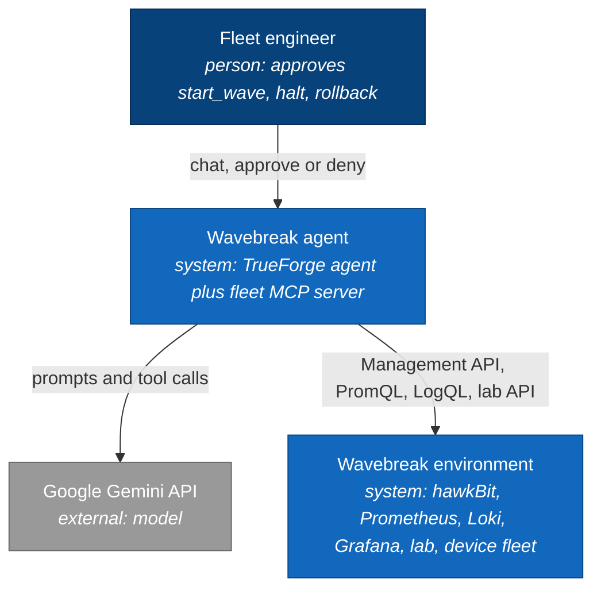

- The agent never touches devices directly. Field devices are reached only through hawkBit; lab devices only through the lab controller API.
- Devices only make outbound connections (DDI poll, remote_write, Loki push).

---

## 2. C4 L2: Containers

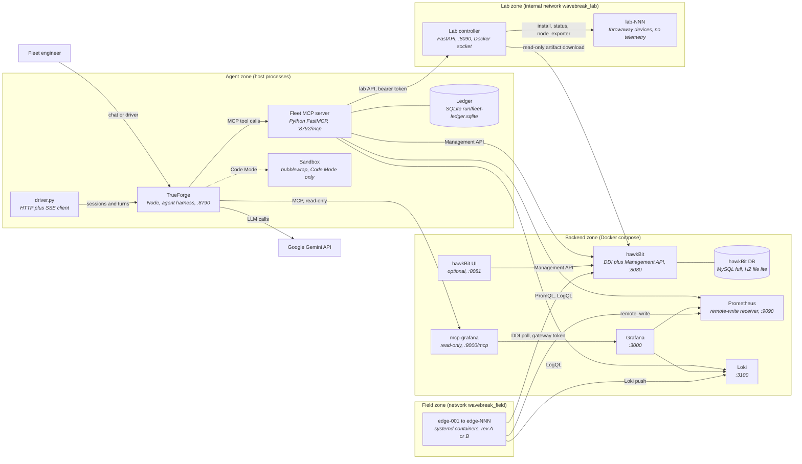

| Container | Image or runtime | Port | Memory | Notes |
|-----------|------------------|------|--------|-------|
| hawkbit | `hawkbit/hawkbit-update-server:1.1.0` | 8080 | 900m | networks backend and field; lite: file-backed H2, full: MySQL |
| hawkbit-db | `mysql:8.0` | none | 768m | full profile only |
| hawkbit-ui | `hawkbit/hawkbit-ui:1.1.0` | 8081 to 8080 | 640m | full profile, or `HAWKBIT_UI=1` on lite |
| prometheus | `prom/prometheus:v3.5.0` | 9090 | 384m | retention 2d, remote-write receiver on |
| loki | `grafana/loki:3.5.0` | 3100 | 384m | retention 48h |
| grafana | `grafana/grafana:12.1.0` | 3000 | 256m | datasources `wb-prometheus`, `wb-loki`, dashboard `wavebreak-fleet` |
| mcp-grafana | `grafana/mcp-grafana:latest` | 8000 | 128m | `--disable-write`, streamable HTTP, Viewer token |
| lab-controller | built from `lab/controller` | 8090 | 128m | only container with the Docker socket |
| hawkbit-mcp | hawkBit image JRE plus Maven jar | 8082 to 8081 | 320m | optional profile `mcp`; not installed, not used by the agent |
| edge-NNN | `sim/device` image | none | 256m Docker cap | field devices; app MemoryMax 48M lite, 96M full |
| TrueForge | `npx @truefoundry/trueforge` | 8790 | shares host | `agent/spike/start_trueforge.sh` |
| Fleet MCP server | `.venv/bin/python -m agent.fleet_mcp` | 8792 | shares host | `agent/start_fleet_mcp.sh`, host process, no auth |

---

## 3. C4 L3: Components

### 3.1 Simulated device

One image (`sim/device/Dockerfile`, Debian bookworm slim, systemd PID 1). Container runtime only; Firecracker is not implemented (see [12. Drift report](#12-drift-report)).

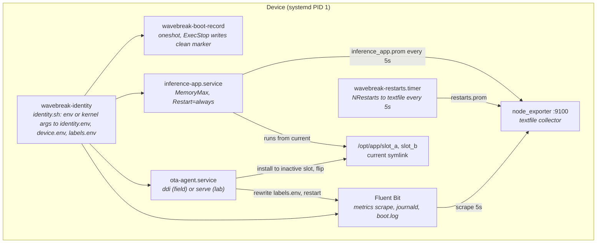

| Item | Value |
|------|-------|
| Identity | `DEVICE_ID`, `HW_REV` (A or B), `REGION`. Container: environment of PID 1. Runs on every boot |
| Files | `/etc/wavebreak/identity.env` (3 keys), `device.env` (rest, mode 600), `labels.env` (device_id, hw_rev, region, fw_version; rewritten by ota-agent after install) |
| MemoryMax | from `APP_MEMORY_MAX` (lite 48M, full 96M) via `systemctl set-property --runtime`; also a Docker cap of 256m on the container |
| inference-app unit | `Restart=always`, `RestartSec=2`, `StartLimitIntervalSec=0`, `MemorySwapMax=0`, `OOMPolicy=stop` |
| Telemetry | `TELEMETRY=1` on field devices; Fluent Bit only starts when `/run/wavebreak/telemetry` exists |
| boot-record | appends `{"event":"boot","boot_id","ts","fw_version","previous_shutdown":"clean or unclean or first_boot","device_id","hw_rev","region"}` to `/var/log/wavebreak/boot.log` |
| kmsg | Firecracker only; never emitted today |

### 3.2 ota-agent

Python stdlib only (`sim/ota-agent`), one install core with two front ends.

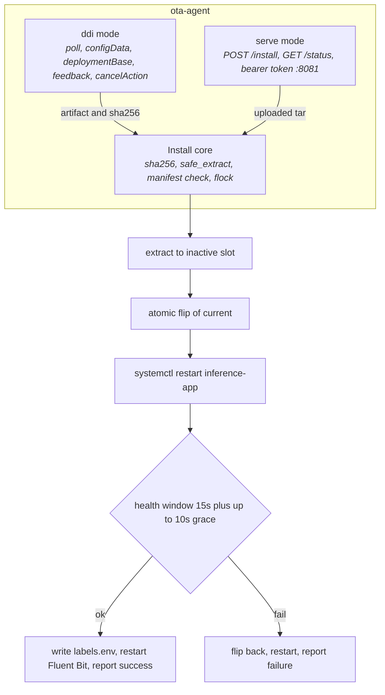

- Health check passes only when the window elapsed, the unit is active, NRestarts is unchanged and at least 2 samples with the new `fw_version` show `frames_total` advancing.
- DDI: registers configData (mode merge), verifies sha256, feedback proceeding then closed success or failure. Assigned equals installed: reports success without reinstalling. Cancel actions are always accepted. Backoff (5 s to 300 s, jitter) applies only after errors; normal cadence is the server's polling sleep.
- The window is short on purpose: v1.3 fails after it closes (see [7](#7-fault-catalogue)).
- Auth: DDI gateway token (D14); local API bearer `LAB_DEVICE_TOKEN`.

### 3.3 Lab controller

`lab/controller/app.py` (FastAPI, uvicorn :8090). The agent side gets only this API: no Docker socket, no root.

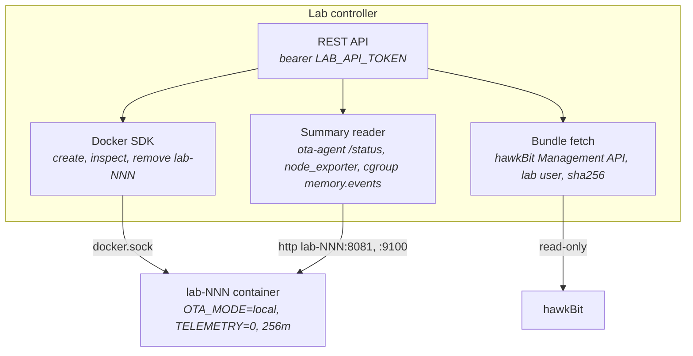

- Lab devices sit only on the internal network `wavebreak_lab`; the controller is on `backend` and `lab`. Devices get no hawkBit tokens and run no Fluent Bit.
- Limits: hw_rev A or B, version matches `v1.[0-4]`, count 1 to 4 per request, 45 s to become ready (504 otherwise).
- `memory_trend` holds one sample per summary call (deque of 60, in memory), so the caller must poll.
- Hardened by the `lab` hawkBit user with six READ authorities (D27).

### 3.4 Fleet MCP server

`agent/fleet_mcp/`, FastMCP streamable HTTP on `127.0.0.1:8792/mcp`, 11 tools. Design and rules: `docs/agent-design.md` §10 to §12.

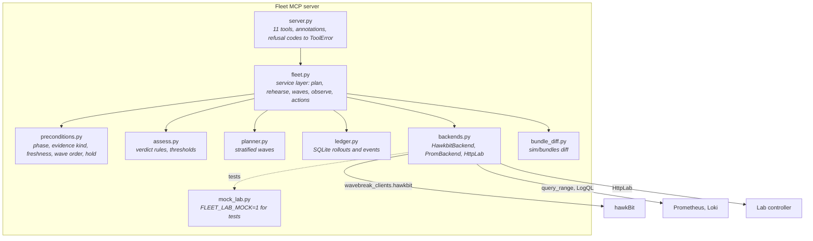

| Tool | Approval | Purpose |
|------|----------|---------|
| `get_fleet_inventory`, `get_rollout_state`, `get_bundle_diff` | no | read |
| `plan_rollout` (`version`, `waves`, `stratify_by`, `exclude_hw_revs`, `exclusion_evidence_id`) | no | plan, or partial plan holding failed hw_revs |
| `rehearse`, `record_decision` | no | lab evidence, audit note |
| `observe_wave`, `verify_recovery` | no | evidence (read-only annotation, write the ledger) |
| `start_wave`, `halt_rollout`, `rollback` | **yes** | destructive, named in `require_approval_for_tools` |

### 3.5 TrueForge agent

Registered by `agent/register.py`; manifest in `agent/wavebreak-agent.json`; playbook in `agent/instructions.md`.

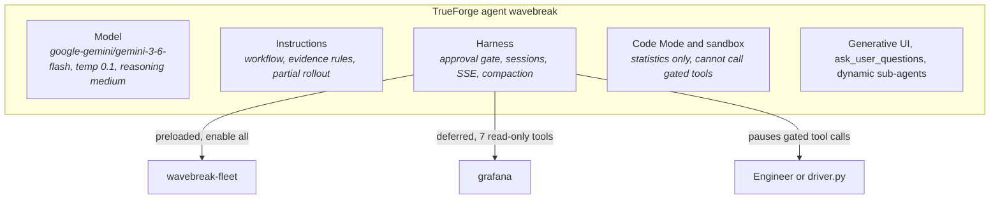

- Approval is enforced by the harness through `require_approval_for_tools = [start_wave, halt_rollout, rollback]`; the server records `approved_via: harness` (see drift C5).
- `iteration_limit` 300; compaction and large tool responses enabled.

---

## 4. Key flows

### 4.1 Release publish

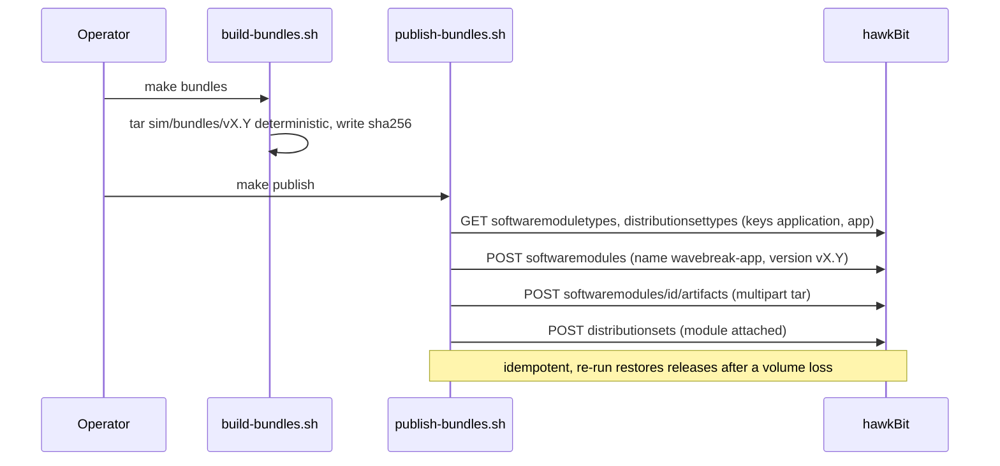

### 4.2 Healthy OTA update with A/B install

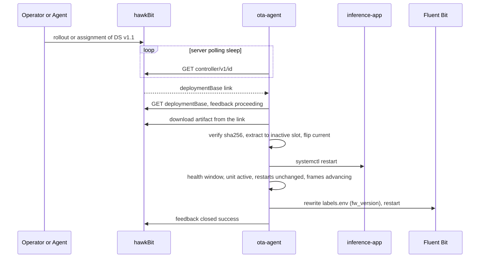

### 4.3 Rehearsal

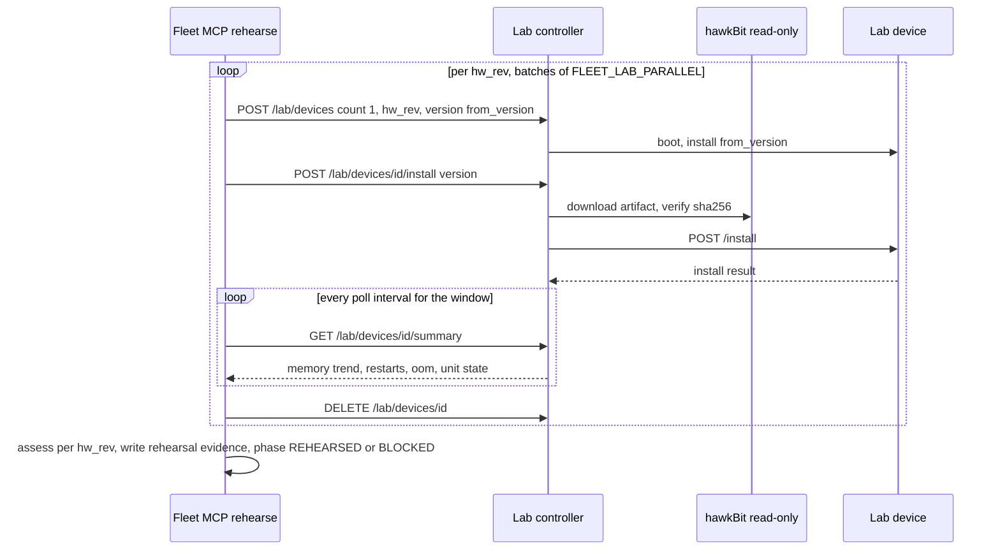

- Rehearsal fails on install failure, unit not active, restarts >= 1, OOM > 0, or memory slope above 1.0 MB/min. Lab devices are destroyed in a `finally`.

### 4.4 Evidence-gated action with approval

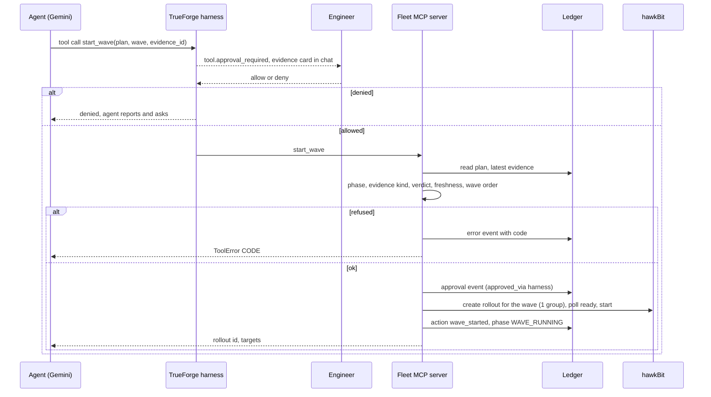

### 4.5 Scene 1: v1.3 blocked

Prompt: "v1.3 is published. Take care of the rollout." Verified end to end through TrueForge on 2026-09-26 (dry run, then re-run as a regression check after Scenes 3 and 2).

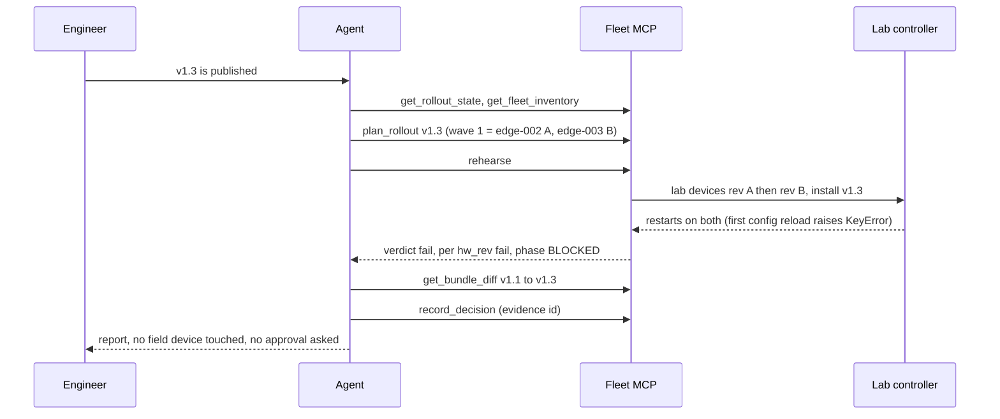

### 4.6 Scene 2: v1.2 partial rollout

Prompt: "v1.2 is published. Take care of the rollout." Rehearsal passes rev A and fails rev B (11 MB/min slope within 90 s). Verified end to end through TrueForge on 2026-09-26 (driver with auto-approve, both approvals logged; run on the lite model because the demo model's free daily quota was exhausted). Result: rev A on v1.2 and healthy, rev B on v1.1, ledger `hold` event referencing the failed rehearsal.

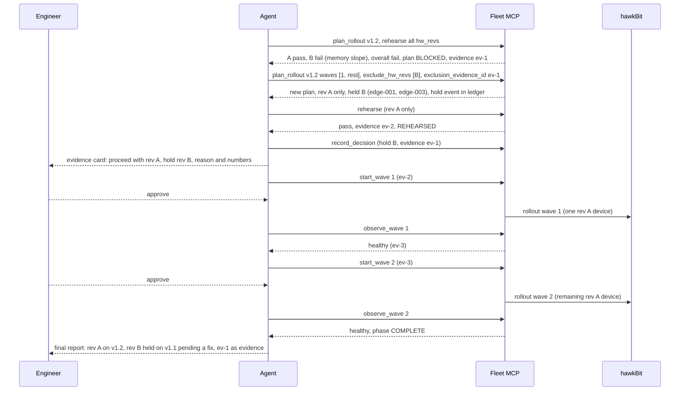

### 4.7 Scene 3: v1.4 full rollout

Prompt: "v1.4 is published. Take care of the rollout." Verified end to end through TrueForge on 2026-09-26 (auto-approve driver, approvals logged).

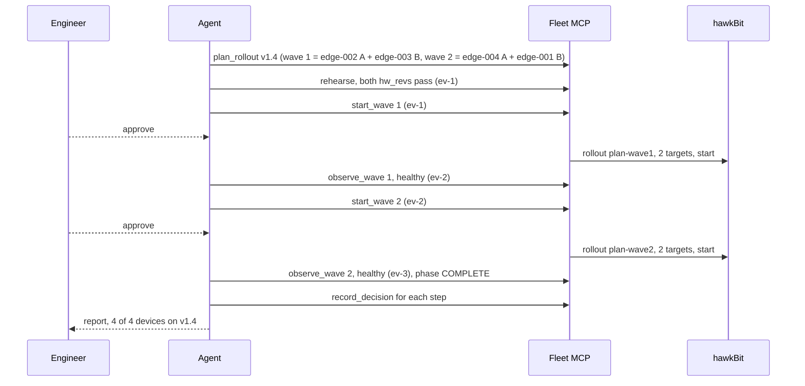

### 4.8 Rollback

Regression path when a wave passes the lab but fails in the field. Unit-tested against the mock backends; not part of the three scenes and not yet run on the real fleet.

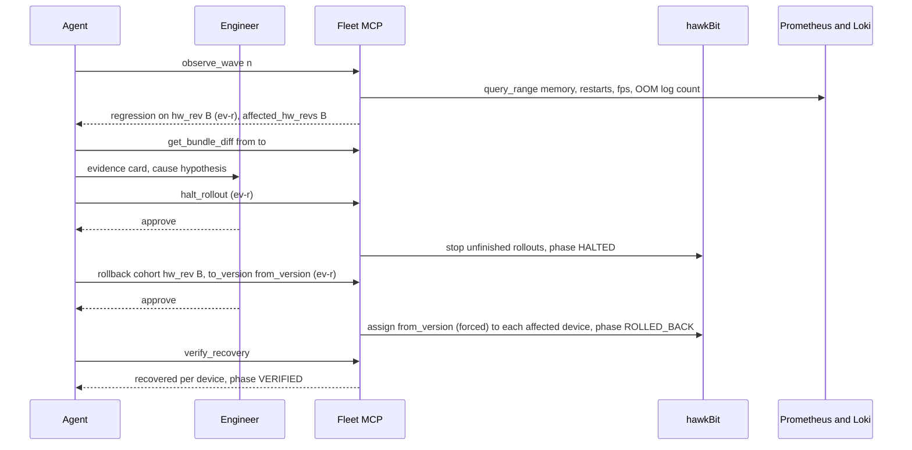

---

## 5. Interfaces

### 5.1 Master table

| Interface | Port and path | Protocol | Caller to callee | Auth |
|-----------|---------------|----------|------------------|------|
| hawkBit DDI | 8080 `/{tenant}/controller/v1/...` | HTTP REST | device to hawkBit | gateway token |
| hawkBit Management API | 8080 `/rest/v1/...` | HTTP REST | fleet MCP, scripts, lab controller to hawkBit | basic (admin, or `lab` user read-only) |
| hawkBit UI | 8081 | HTTP | operator | hawkBit user |
| Prometheus write | 9090 `/api/v1/write` | remote_write | device to Prometheus | none (private) |
| Prometheus query | 9090 `/api/v1/query`, `/query_range` | HTTP | fleet MCP, Grafana | none |
| Loki push | 3100 `/loki/api/v1/push` | HTTP | device to Loki | none (private) |
| Loki query | 3100 `/loki/api/v1/query`, `/query_range` | HTTP | fleet MCP, Grafana | none |
| Grafana | 3000, proxy `/api/datasources/proxy/uid/...` | HTTP | operator, mcp-grafana | admin login, Viewer token |
| mcp-grafana | 8000 `/mcp` | MCP streamable HTTP | TrueForge to mcp-grafana | none inside the security group |
| Lab controller | 8090 `/lab/devices...`, `/healthz` | HTTP REST | fleet MCP to lab controller | bearer `LAB_API_TOKEN` |
| ota-agent local API | 8081 `/install`, `/status` (in each lab device) | HTTP | lab controller to lab device | bearer `LAB_DEVICE_TOKEN` |
| node_exporter | 9100 `/metrics` (device local) | HTTP | Fluent Bit, lab controller | none |
| Fleet MCP | 8792 `/mcp` | MCP streamable HTTP | TrueForge to fleet MCP | none (127.0.0.1 only) |
| TrueForge API | 8790 `/api/v1/...` | HTTP plus SSE | driver, register, UI | none (127.0.0.1) |
| hawkBit MCP | 8082 `/mcp` | MCP | optional, unused | Basic pass-through |

### 5.2 hawkBit DDI API (device-facing)

| Endpoint | Method | Purpose |
|----------|--------|---------|
| `/{tenant}/controller/v1/{id}` | GET | poll, links and polling sleep |
| `.../{id}/configData` | PUT | attributes, body `{mode: merge, data: {device_id, hw_rev, region, fw_version}}` |
| `.../{id}/deploymentBase/{actionId}` | GET | deployment, chunks, artifact links (the link is used for download) |
| `.../{id}/deploymentBase/{actionId}/feedback` | POST | proceeding, closed success or failure |
| `.../{id}/cancelAction/{actionId}/feedback` | POST | accept cancel |

Auth header `Authorization: GatewayToken <token>` (or `TargetToken`, see drift C-E8). Tenant `DEFAULT`; tenant config `pollingTime` set by `scripts/hawkbit-config.sh` (10 s locally, minimum 5 s via `hawkbit.controller.minPollingTime`).

### 5.3 hawkBit Management API calls actually made

| Caller | Calls |
|--------|-------|
| `wavebreak_clients/hawkbit.py` | GET `targets`, `targets/{id}`, `/attributes`, `/installedDS`, `/actions`, `/actions/{id}`; GET `distributionsets` (q name and version); POST `distributionsets/{id}/assignedTargets` (forced); POST `rollouts`; POST `rollouts/{id}/start`, `/pause`, `/resume`, `/stop`; GET `rollouts/{id}`, `/deploygroups`; GET `softwaremodules/{m}/artifacts/{a}/download` |
| `create_wave` body | `amountGroups: 1`, `dynamic: false`, forced, weight 400, success THRESHOLD 100 then NEXTGROUP, error THRESHOLD 1 then PAUSE, `targetFilterQuery: controllerId=in=(a,b)` (verified live 2026-09-26) |
| `scripts/publish-bundles.sh` | GET `softwaremoduletypes`, `distributionsettypes`; GET, POST `softwaremodules` (type key `application`); POST `softwaremodules/{id}/artifacts`; GET, POST `distributionsets` (type key `app`) |
| `scripts/seed.sh` | GET `targets?q=controllerId==edge-*`; POST `distributionsets/{id}/assignedTargets`; GET `installedDS` |
| `scripts/demo-reset.sh` | GET `rollouts`; POST `rollouts/{id}/stop`; GET `targets/{t}/actions`; DELETE `targets/{t}/actions/{a}` |
| `scripts/hawkbit-config.sh` | PUT `system/configs/{key}`: `authentication.gatewaytoken.enabled`, `.key`, `authentication.targettoken.enabled`, `pollingTime` |
| lab controller (user `lab`) | GET `softwaremodules?q=name==wavebreak-app;version==X`, `softwaremodules/{id}/artifacts`, artifact download, sha256 check |
| `HawkbitBackend` | `start_wave`: create rollout, poll `GET rollouts/{id}` up to 60 s until `ready`, then start (fails closed). `halt`: stop rollouts not finished. `rollback`: assign `from_version` forced per device |

hawkBit facts: image `hawkbit/hawkbit-update-server:1.1.0` (monolith), OpenAPI at `/v3/api-docs`, heap via `X_MS`, `X_MX`, metaspace env (compose sets 128m and 512m), users via `-Dhawkbit.security.user.<name>.{tenant,password,roles,permissions}` with `{noop}` passwords. Software module `type` in POST bodies is the type KEY.

Canary waves are separate hawkBit rollouts: `create_wave` makes a one-group rollout left unstarted; `start_rollout` is a separate call after approval. Success in one wave cannot start the next (A8). Verified live: Scene 3 produced rollouts `plan-...-wave1` and `plan-...-wave2`, 2 targets each.

hawkBit MCP server (optional, T2.2): Maven Central jar `org.eclipse.hawkbit:hawkbit-mcp-server:1.1.0`, run on the hawkBit image JRE, `server.port=8081`, streamable HTTP, `hawkbit.mcp.mgmt-url`. The agent does not use it (A3, A4).

### 5.4 ota-agent local API (lab devices only)

| Endpoint | Method | Purpose |
|----------|--------|---------|
| `/install` | POST | raw tar body (max 64 MiB), optional `X-Sha256`; 200 ok, 422 install failed, 400 bad length |
| `/status` | GET | `fw_version`, `slot`, `unit_state`, `restarts`, `last_install` |

Auth: `Authorization: Bearer <LAB_DEVICE_TOKEN>`; the server refuses to start without a token. Port `LOCAL_API_PORT` (8081).

### 5.5 Lab controller API (agent-facing)

| Endpoint | Method | Purpose |
|----------|--------|---------|
| `/lab/devices` | POST | `{count 1 to 4, hw_rev A or B, version}`: boot lab devices, install the bundle (unless v1.0); returns ids |
| `/lab/devices` | GET | list |
| `/lab/devices/{id}/install` | POST | `{version}`: fetch from hawkBit read-only, upload to device |
| `/lab/devices/{id}/summary` | GET | `hw_rev`, `fw_version`, `memory_trend [{ts, memory_bytes}]`, `memory_bytes`, `restarts`, `oom_kills`, `unit_state`, `last_install_result`, `container_state` |
| `/lab/devices/{id}` | DELETE | destroy |
| `/healthz` | GET | health, no auth |

Auth `Authorization: Bearer <LAB_API_TOKEN>` (401 bad token, 503 if unset). A device 422 (install failure) surfaces as 502 from the controller (drift C-E3).

### 5.6 Fleet MCP tools

Argument-level specs, preconditions, refusal codes: `docs/agent-design.md` §10 and §10.1. Summary of signatures:

| Tool | Arguments |
|------|-----------|
| `get_fleet_inventory` | none |
| `get_rollout_state` | `plan_id?` |
| `plan_rollout` | `version`, `waves?` (default 2, 5, "rest"), `stratify_by?` (hw_rev, region, version), `exclude_hw_revs?`, `exclusion_evidence_id?` |
| `rehearse` | `plan_id`, `hw_revs?`, `minutes?` (default 2, max 5) |
| `get_bundle_diff` | `from_version`, `to_version` |
| `start_wave` | `plan_id`, `wave`, `evidence_id` |
| `observe_wave` | `plan_id`, `wave`, `minutes?` (default 2, max 4) |
| `record_decision` | `plan_id`, `decision`, `rationale`, `evidence_ids?` |
| `halt_rollout` | `plan_id`, `evidence_id` |
| `rollback` | `plan_id`, `to_version`, `evidence_id`, one of `cohort` (dict, like hw_rev B) or `targets` (list) |
| `verify_recovery` | `plan_id`, `targets?`, `minutes?` |

Config env vars: `HAWKBIT_URL`, `HAWKBIT_USERNAME`, `HAWKBIT_PASSWORD`, `PROMETHEUS_URL`, `LOKI_URL`, `LAB_CONTROLLER_URL`, `LAB_API_TOKEN`, `FLEET_LEDGER_PATH` (`run/fleet-ledger.sqlite`), `FLEET_MCP_HOST` (127.0.0.1), `FLEET_MCP_PORT` (8792), `FLEET_LAB_MOCK`, `FLEET_LAB_MOCK_SCENARIOS`, `FLEET_LAB_MOCK_TIME_SCALE`, `FLEET_EVIDENCE_MAX_AGE_S` (900), `FLEET_LAB_MAX_MINUTES` (5), `FLEET_LAB_PARALLEL` (server default 2; `agent/start_fleet_mcp.sh` sets 1, the AWS installer sets 2), `FLEET_OBSERVE_MAX_MINUTES` (4), `FLEET_POLL_INTERVAL_S` (15), `BUNDLES_DIR` (`sim/bundles`), `FLEET_TH_<FIELD>` (threshold overrides).

### 5.7 TrueForge API used

| Caller | Call |
|--------|------|
| `agent/register.py` | `PUT /api/v1/settings/mcp-servers` (fleet, grafana); `GET /api/v1/agents`; `PUT /api/v1/agents/{id}` (body without `name`) or `POST /api/v1/agents` |
| `agent/driver.py` | `POST /api/v1/sessions` (agent name wavebreak); `POST /api/v1/sessions/{id}/turns` with `stream: true` (SSE events `model.message.delta`, `tool.response`, `tool.approval_required`, `turn.done`); resume with `user.tool_approval` items (allow or deny) |

TrueForge start: `agent/spike/start_trueforge.sh` sets `OUTBOUND_URL_ALLOWED_HOSTS='["127.0.0.1","localhost"]'` (its SSRF guard blocks loopback otherwise) and `MCP_REQUEST_TIMEOUT_MS=900000` (default 240000 is too short for `observe_wave` and `rehearse`). Model key in `agent/spike/.env` (`GEMINI_API_KEY`).

### 5.8 Telemetry ingest and Fluent Bit pipeline

Install (Debian bookworm): apt repo `packages.fluentbit.io`, package `fluent-bit`; validate with `fluent-bit --dry-run -c <file>`.

| Stage | Plugin | Config (from `sim/device/.../wavebreak.conf`) |
|-------|--------|-----------------------------------------------|
| input | `prometheus_scrape` | `127.0.0.1:9100`, `/metrics`, every 5 s |
| input | `systemd` | units `inference-app.service`, `ota-agent.service`, `_PID=1`; `read_from_tail`, `strip_underscores`, `lowercase`, db |
| input | `tail` | `/var/log/wavebreak/boot.log`, parser json, `read_from_head` |
| input | `kmsg` | Firecracker only (runtime include file), not emitted |
| filter | `record_modifier` | `source journal` or `source boot` |
| output | `prometheus_remote_write` | `${PROM_HOST}:${PROM_PORT}/api/v1/write`, `add_label` device_id, hw_rev, region, fw_version, `retry_limit 3` |
| output | `loki` | `${LOKI_HOST}:${LOKI_PORT}`, `match_regex ^(journal or boot or kmsg)$`, labels `job=wavebreak, device_id, hw_rev, region, fw_version, $source`, `line_format json` |

Labels come from `labels.env` via the unit's `EnvironmentFile`; `${VAR}` is substituted at load, so ota-agent restarts Fluent Bit after rewriting it. Prometheus label substitution is proven by working demos; Loki `labels` substitution is not separately proven (Q7).

### 5.9 Ports

| Port | Service |
|------|---------|
| 8080 | hawkBit DDI and Management API |
| 8081 | hawkBit UI (host); ota-agent local API inside lab devices |
| 8082 | hawkBit MCP (optional, not installed) |
| 8000 | mcp-grafana |
| 8090 | Lab controller |
| 8790 | TrueForge |
| 8792 | Fleet MCP server |
| 9090 | Prometheus (keep private) |
| 3100 | Loki (keep private) |
| 3000 | Grafana |
| 9100 | node_exporter (device local) |

---

## 6. Data

### 6.1 Device metrics (textfile collector)

In containers node_exporter reports **host** memory, so app-level and cgroup metrics are authoritative (D11).

| Metric | Type | Description |
|--------|------|-------------|
| `wavebreak_app_info{fw_version,sensor}` | gauge (1) | running version, sensor 1080p or 4K |
| `wavebreak_app_rss_bytes` | gauge | app RSS |
| `wavebreak_app_cgroup_memory_bytes` | gauge | unit cgroup `memory.current` (omitted if unreadable) |
| `wavebreak_app_frames_total` | counter | frames processed, heartbeat for the health window |
| `wavebreak_app_fps` | gauge | frames per second |
| `wavebreak_app_cache_items` | gauge | items in cache (includes the enhance buffer on v1.2 and v1.4) |
| `wavebreak_app_frame_latency_seconds` | gauge | per-frame latency (v1.1 and later) |
| `wavebreak_app_restarts_total` | counter | systemd NRestarts (timer unit) |
| `wavebreak_app_last_result{result}` | gauge | systemd Result |
| `wavebreak_device_boot_time_seconds` | gauge | boot timestamp |

Every series carries `device_id`, `hw_rev`, `region`, `fw_version` (added by Fluent Bit). The fleet MCP uses `wavebreak_app_cgroup_memory_bytes`, `wavebreak_app_restarts_total` and `wavebreak_app_fps`.

### 6.2 Log streams (Loki)

| Label | Values |
|-------|--------|
| `job` | `wavebreak` |
| `device_id` | `edge-001` to `edge-020` (lab devices send no telemetry) |
| `hw_rev` | `A`, `B` |
| `region` | `us-east`, `eu-west`, `ap-south` |
| `fw_version` | `v1.0` to `v1.4` |
| `source` | `journal`, `boot` (`kmsg` reserved for Firecracker) |

Log lines are JSON. App events: `startup`, `frame_stats` (every 5 s: `frames_total`, `fps`, `cache_items`, `detections`, `latency_s`), `config_reload`, `config_reload_failed`, `shutdown`. ota-agent events: `install_start`, `install_result` (`ok`, `msg`), `install_rollback`, `config_data_sent`, `deployment_received`, `ddi_error`, `action_canceled`, `local_api_start`, `local_api_request`.

| Pattern | Meaning |
|---------|---------|
| `Failed with result 'oom-kill'` | OOM kill (the fleet MCP counts this line per device) |
| `"event":"config_reload_failed"` then a KeyError traceback | v1.3 crash |
| `"event":"install_result"` | install success or failure |
| `"previous_shutdown":"unclean"` | crash or power loss before this boot |

Log JSON is compact (no space after the colon); match on substrings.

### 6.3 Boot and availability records

`/var/log/wavebreak/boot.log`: one JSON line per boot (fields in [3.1](#3-1-simulated-device)). The marker `/var/lib/wavebreak/clean_shutdown` is touched on unit stop; a missing marker means `unclean`. Containers generate a `boot_id` per start (the kernel one is the host's).

### 6.4 Device identity and hawkBit attributes

| Attribute | Source | Values |
|-----------|--------|--------|
| `device_id` | env `DEVICE_ID` | `edge-001` and up; lab `lab-NNN` |
| `hw_rev` | env `HW_REV` | `A`, `B` (rev B is the 4K sensor) |
| `region` | env `REGION` | `us-east`, `eu-west`, `ap-south`; lab `lab` |
| `fw_version` | installed release | `v1.0` to `v1.4` |

Sent to hawkBit as configData; the fleet MCP reads them from `GET targets/{id}/attributes`. Fleet (`sim/fleet/fleet.yaml`): lite 4 devices (edge-001 B us-east, edge-002 A eu-west, edge-003 B ap-south, edge-004 A us-east), full 20 devices (12 A, 8 B); rev B rule: device i is B iff ceil(0.4 i) > ceil(0.4 (i-1)) (D21).

### 6.5 Ledger schema

SQLite, `run/fleet-ledger.sqlite` (host file, WAL, one connection per call). hawkBit stays the source of truth for what is deployed; the ledger records why.

```sql
CREATE TABLE rollouts (
  plan_id TEXT PRIMARY KEY,        -- plan-YYYYMMDD-xxxx
  version TEXT NOT NULL,
  from_version TEXT NOT NULL,
  waves_json TEXT NOT NULL,        -- {"waves": [[ids]], "devices": {id: {hw_rev, region}}, "held": [{hw_rev, device_ids, evidence_id, reasons, reason}]}
  phase TEXT NOT NULL,
  created_at TEXT NOT NULL,
  updated_at TEXT NOT NULL
);
CREATE TABLE events (
  id INTEGER PRIMARY KEY AUTOINCREMENT,
  plan_id TEXT NOT NULL,
  ts TEXT NOT NULL,
  type TEXT NOT NULL,              -- rehearsal, observation, decision, approval, action, verification, hold, error
  wave INTEGER,
  evidence_id TEXT,                -- ev-xxxxxxxx, set for rehearsal, observation, verification
  payload_json TEXT NOT NULL
);
```

- Phases: PLANNED, REHEARSED, BLOCKED, WAVE_RUNNING, WAVE_OBSERVED, COMPLETE, HALTED, ROLLED_BACK, VERIFIED. Terminal: BLOCKED, COMPLETE, VERIFIED.
- Action kinds (type `action`): `plan_created`, `superseded`, `wave_started`, `halt`, `rollback`.
- `hold` event: `{hw_revs, device_ids, evidence_id, source_plan_id, reasons}`; the plan's `held` list carries the same cohort and shows in `get_rollout_state`.
- `approval` event: `{tool, approved_via: harness, evidence_id}`, written by the server after the preconditions pass.
- `get_rollout_state` merges ledger and hawkBit and is the compaction-safe source of truth for progress.

---

## 7. Fault catalogue

| ID | Release | Trigger (real code) | Cohort | Symptoms | Onset | hawkBit sees | Agent does |
|----|---------|---------------------|--------|----------|-------|--------------|------------|
| F1 | v1.2 | `enhance_buffer` list appended per frame when the sensor is 4K, never evicted | rev B only | cgroup memory climbs about 11 to 12 MB/min at lite scale, OOM kill at MemoryMax, restart, repeat | slope visible within 90 s; OOM about 3 min after start | success on both revs | rehearsal fails rev B (slope), passes rev A; partial rollout, rev B held |
| F2 | v1.3 | config key renamed (`confidence_threshold`) with no migration; first reload reads a missing key | all devices | `config_reload_failed`, KeyError, crash every ~47 s (45 s reload plus 2 s restart), `restarts_total` rising; fps looks normal between crashes | first reload 45 s after each start, after the 15 s health window | success | rehearsal fails on both revs, plan BLOCKED, report with `get_bundle_diff` |
| none | v1.0 | baseline | all | healthy | | | |
| none | v1.1 | adds per-frame latency metric | all | healthy | | | |
| none | v1.4 | bounded enhance buffer (`deque(maxlen=4)`), config key restored | all | healthy | | success | rehearsal passes, full rollout |

Details:

- v1.3 is built from v1.1 (no enhance buffer), so rev B does not leak on v1.3; v1.4 fixes both F1 and F2.
- Bundle config defaults: `frame_bytes_1080p` 16384, `frame_bytes_4k` 40960 (times `WAVEBREAK_FRAME_SCALE`), `frame_interval_s` 0.2, `metrics_interval_s` 5, `config_reload_interval_s` 45.
- Bundle layout: `sim/bundles/vX.Y/{manifest.json, app/, config.yaml}` to `build/bundles/wavebreak-app-vX.Y.tar` plus `.sha256`.

Timeline F1: T+0 v1.2 installed, health window passes, hawkBit shows success. T+0 to 3 min rev B memory climbs, rev A flat. About T+3 min OOM at MemoryMax, systemd restarts, cycle repeats.

Timeline F2: T+0 v1.3 installed, 15 s window passes. T+45 s first config reload raises, systemd restarts after 2 s, repeats on every device.

---

## 8. Rollout state machine

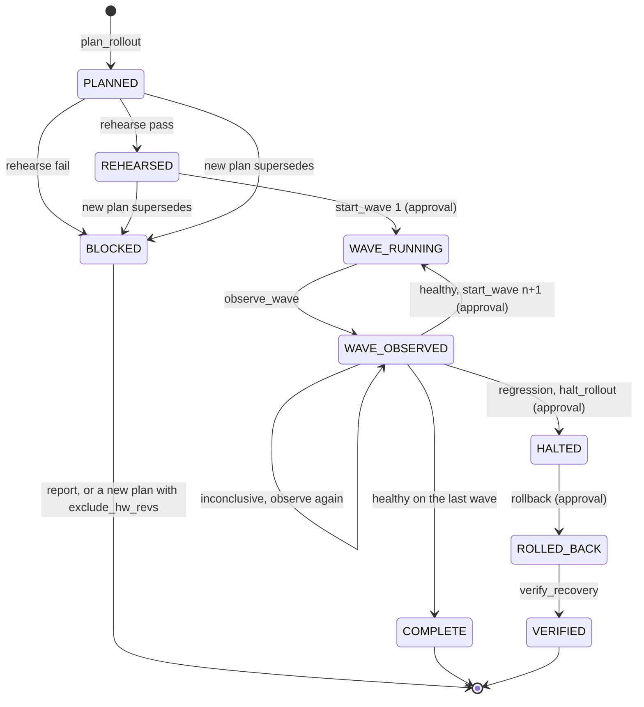

- A new plan is refused (`ACTIVE_PLAN_EXISTS`) while another is in WAVE_RUNNING, WAVE_OBSERVED, HALTED or ROLLED_BACK. PLANNED and REHEARSED plans are superseded (set to BLOCKED with an `action` event `superseded`).
- Partial rollout: a BLOCKED plan whose rehearsal failed for only some hw_revs is followed by a new plan with `exclude_hw_revs` and the failed rehearsal's `evidence_id`. The new plan covers the kept hw_revs, is rehearsed again, and records the hold. Held devices are never in a wave.
- Default waves 2, 5, rest, stratified by hw_rev (round-robin over strata, regions spread). On the 4-device lab fleet the default gives wave 1 = 2 devices, wave 2 = the rest; for a single-cohort partial plan use `[1, "rest"]`.

---

## 9. Deployment and runbook

| | Local (WSL, dev) | AWS (build day) |
|--|------------------|-----------------|
| Profile | lite (4 devices, H2) | full (20 devices, MySQL) |
| Runtime | container | container (Firecracker is not implemented) |
| Host | 3.5 GB RAM (shared with TrueForge), 8 vCPU | `m8i.2xlarge`, Ubuntu 24.04 amd64, 60 GB gp3 |
| Access | localhost | security group inbound limited to the operator's `/32`: 22, 3000, 8000, 8080, 8081, 8090 |
| Bootstrap | Makefile targets | `infra/aws/install.sh` (static-reviewed, not yet run on AWS) |

Make targets (`PROFILE=lite or full`): `up`, `down`, `reset`, `ps`, `hawkbit-config`, `bundles`, `publish`, `fleet`, `fleet-down`, `fleet-status`, `seed`, `lab`, `demo-reset`, `demo-status`, `grafana-sa`, `e2e`, `test`, `lint`, `all`, `view`.

### 9.1 Local lite runbook

Memory rules: keep `wavebreak-hawkbit-ui-1` stopped while testing, `FLEET_LAB_PARALLEL=1`, never more than 4 field plus 1 lab device.

```bash
cp .env.example .env
make up PROFILE=lite
make bundles publish
make grafana-sa
make demo-reset          # 4 devices on v1.1 and healthy, lab empty (about 45 to 65 s)
make demo-status

python3 -m venv .venv && .venv/bin/pip install -r agent/requirements.txt   # plus agent/spike/.env with GEMINI_API_KEY (git-ignored)
agent/spike/start_trueforge.sh        # :8790, refuses a second copy
agent/start_fleet_mcp.sh              # :8792, log run/fleet-mcp.log, FLEET_LAB_PARALLEL defaults to 1 in the script
.venv/bin/python agent/register.py    # MCP servers and the wavebreak agent
.venv/bin/python agent/driver.py "v1.3 is published. Take care of the rollout."
```

`make demo-reset` stops active rollouts, cancels active actions, assigns v1.1, waits for healthy reports and empties the lab; run it before each scene. `scripts/e2e.sh` removes the lite fleet on exit, so run `make demo-reset` again after it. Grafana `http://localhost:3000` (admin, `GRAFANA_ADMIN_PASSWORD`). Optional hawkBit UI: `make up PROFILE=lite HAWKBIT_UI=1`, `http://localhost:8081`. When finished: `make fleet-down PROFILE=lite RUNTIME=container` and `make down`.

### 9.2 Full profile

On a host with memory for the full backend and 20 devices: `make up PROFILE=full RUNTIME=container`, `make bundles publish`, `make fleet PROFILE=full RUNTIME=container`, `make demo-reset PROFILE=full`, `make grafana-sa`, `make demo-status`. Note drift C-E1: `demo-reset.sh` waits for exactly 4 devices, so the full-profile reset does not complete until that is fixed.

### 9.3 AWS launch checklist

Before launch, push `master` to `origin`; the bootstrap URL and default clone read `master`.

1. Launch an `m8i.2xlarge` with Ubuntu 24.04 amd64, a 60 GiB gp3 root volume, a key pair and a public IPv4 address.
2. Security group with source `<YOUR_PUBLIC_IP>/32` on every rule: TCP 22, 3000, 8000, 8080, 8081, 8090. Add 8082 only if the hawkBit MCP is installed. Do not open 9090 or 3100 (Docker-published ports bypass UFW; keep them closed at the security group). Also keep 8790 and 8792 closed (localhost only).
3. SSH in as `ubuntu`, then:

   ```bash
   curl -fsSL https://raw.githubusercontent.com/phoenixsac/wavebreak/master/infra/aws/install.sh -o /tmp/wavebreak-install.sh
   sudo env REPO_DIR=/opt/wavebreak bash /tmp/wavebreak-install.sh
   ```

The installer installs Docker Engine and Compose, Node.js 22 (TrueForge needs 22.14 or newer), `socat`, `ripgrep`, `python3-venv`; clones or fast-forwards the repo; starts the full profile; publishes bundles; launches the fleet; resets it to v1.1; creates the Grafana Viewer token; creates `.venv` from `agent/requirements.txt`; starts TrueForge (`OUTBOUND_URL_ALLOWED_HOSTS`, `MCP_REQUEST_TIMEOUT_MS=900000`) and the fleet MCP server; registers the agent; prints URLs. It preserves non-example secrets in `.env` (root-owned, mode 0600) and generates replacements for example credentials. It expects `agent/spike/.env` with `GEMINI_API_KEY` (warns if missing). It does not create the EC2 instance or security group. It has only had static checks; the full-profile reset path is not live-tested on 20 devices.

---

## 10. Decisions log

Environment decisions (D-series) and agent decisions (A-series, full rationale in `docs/agent-design.md` §23).

| ID | Decision | Reason | Date |
|----|----------|--------|------|
| D1 | Real hawkBit, not a mock | Production-like behaviour; OSS with Docker images | 2026-09-25 |
| D2 | Debian + systemd devices | journald, unit management, MemoryMax and OOM semantics | 2026-09-25 |
| D3 | Fluent Bit on devices | One lightweight agent for metrics (remote_write) and logs (Loki) | 2026-09-25 |
| D4 | A/B **app** slots under `/opt/app` (supersedes rootfs slots) | Clean rollback semantics without rebuilding rootfs | 2026-09-25 |
| D5 | Faults are real code diffs | Symptoms emerge from processes misbehaving, never fabricated logs | 2026-09-25 |
| D6 | Mermaid flowcharts styled as C4 | Mermaid C4 syntax renders unreliably | 2026-09-25 |
| D7 | architecture.md is the single design source for the environment; HTML is generated | One file to maintain | 2026-09-25 |
| D8 | Three zones: backend, field, lab (agent zone added 2026-09-26) | Mirrors production: devices behind NAT, isolated rehearsal | 2026-09-25 |
| D9 | Devices push telemetry; no Prometheus scraping of devices | Real devices are behind NAT and only initiate outbound connections | 2026-09-25 |
| D10 | Releases v1.0 to v1.4 as app bundles | Two independent faults plus a fix release | 2026-09-25 |
| D11 | App-level and cgroup metrics are the memory source of truth | node_exporter in containers reports host memory | 2026-09-25 |
| D12 | systemd containers run with `--cgroupns=host -v /sys/fs/cgroup:/sys/fs/cgroup:rw --tmpfs /run --tmpfs /run/lock`, not privileged | Verified in WSL: reaches running, MemoryMax enforced | 2026-09-25 |
| D13 | Firecracker guest kernel from the CI bucket (newest 6.1 that exists) | Verified: v1.15 has 6.1.155 and boots under KVM in WSL. Runtime otherwise parked | 2026-09-25 |
| D14 | DDI auth via gateway token | One token for the simulation; production would use per-device tokens or mTLS | 2026-09-25 |
| D15 | Rootless rootfs build via `docker export` and `fakeroot mkfs.ext4 -d` (planned, unbuilt) | No sudo needed | 2026-09-25 |
| D16 | Lab controller is a compose service on backend and lab networks | Agent gets only the token API. Host-process variant for Firecracker not built | 2026-09-25 |
| D17 | Device-side Python is stdlib only | Small image, no pip in rootfs | 2026-09-25 |
| D18 | Part A built by an overnight headless Claude loop with cheap subagents | Save build-day tokens for the agent | 2026-09-25 |
| D19 | hawkBit MCP runs the Maven Central jar on the hawkBit image JRE (optional profile `mcp`) | No official image; no local Maven build | 2026-09-25 |
| D20 | Release source in `sim/bundles/vX.Y/` (full copies); `sim/inference-app/` holds shared tests | Releases must be real, diffable code | 2026-09-25 |
| D21 | Rev B: device i is B iff ceil(0.4 i) > ceil(0.4 (i-1)) | Deterministic, spread; edge-001 is B | 2026-09-25 |
| D22 | Lite hawkBit uses file-backed H2 with `MODE=LEGACY` in the `hawkbit-artifacts` volume | Image default H2 lost state on recreation; H2 2.x needs legacy mode | 2026-09-26 |
| D23 | If the lite volume is removed, run `make publish` then `make seed` | Idempotent publisher restores v1.0 to v1.4 | 2026-09-26 |
| D24 | Identity setup uses temp files under `/run/wavebreak` with an exit trap | `/tmp` file missing during early boot | 2026-09-26 |
| D25 | Fleet `frame_scale` passes as `WAVEBREAK_FRAME_SCALE` | Profile controls allocation rate; identity must preserve the name | 2026-09-26 |
| D26 | E2E restart checks take the max over matching series scoped to the installed firmware | remote-write keeps series across label changes | 2026-09-26 |
| D27 | Lab controller fetches bundles as a dedicated hawkBit user with six READ authorities | Rehearsal must download releases without write access; target creation returns 403 | 2026-09-26 |
| D28 | Grafana dashboard `Wavebreak Fleet` provisioned from `platform/grafana/dashboards/wavebreak-fleet.json` | One checked-in dashboard for version mix, memory, restarts, fps, OOM logs | 2026-09-26 |
| D29 | hawkBit UI is a separate optional 1.1.0 service, 384 MiB heap; on by default in full, `HAWKBIT_UI=1` in lite | Keep lite memory small | 2026-09-26 |
| D30 | `make demo-reset` stops rollouts, cancels actions, assigns v1.1, waits for healthy, empties the lab | Repeatable demo state. Full profile count not yet parameterised (drift) | 2026-09-26 |
| D31 | `make grafana-sa` rotates a Viewer token into `.env` and recreates mcp-grafana | Read-only MCP access, reproducible | 2026-09-26 |
| D32 | AWS bootstrap via `infra/aws/install.sh`, Docker apt repo, NodeSource 22.x, generated credentials | One repeatable setup; TrueForge needs Node 22.14+ | 2026-09-26 |
| D33 | `infra/aws/install.sh` also installs `agent/requirements.txt`, starts TrueForge and the fleet MCP with the guarded start scripts, and registers the agent | Whole demo comes up from one script | 2026-09-26 |
| A1 | Agent is a rollout manager, not a passive monitor | Owns the full loop | 2026-09-26 |
| A2 | Single root agent, no multi-agent orchestration | Phases are sequential | 2026-09-26 |
| A3 | Custom wavebreak-fleet MCP server | Evidence joins, lab access, gated actions, ledger | 2026-09-26 |
| A4 | Grafana and hawkBit MCP read-only; all actions via evidence-gated tools | Structural safety | 2026-09-26 |
| A5 | Approval by tool name plus annotations | Unannotated tools would run ungated, including from Code Mode | 2026-09-26 |
| A6 | Evidence-id preconditions on action tools | Evidence before verdict, structurally | 2026-09-26 |
| A7 | SQLite ledger plus hawkBit as state | Compaction and restart safe; audit trail | 2026-09-26 |
| A8 | One hawkBit rollout per wave | Prevents install-success auto-cascade | 2026-09-26 |
| A9 | Stratified canaries by hw_rev | A subset bug cannot slip past wave 1 | 2026-09-26 |
| A10 | Rehearsal lab is ours; the sandbox is for Code Mode and skills only | Sandbox cannot reach devices or localhost | 2026-09-26 |
| A11 | Gen UI for evidence display; tool approval is the gate | Gen UI buttons are not a guaranteed stop | 2026-09-26 |
| A12 | Blocking `observe_wave` with fallbacks | No native wait in TrueForge | 2026-09-26 |
| A13 | Model: Google Gemini via TrueForge's `google-gemini` provider (gemini-3.6-flash) | AI Gateway is enterprise-only | 2026-09-26 |
| A14 | Sandbox: TrueForge local bubblewrap fallback (socat, ripgrep); Daytona optional | Verified working; weaker than Daytona | 2026-09-26 |
| A15 | Every state-changing tool named in `require_approval_for_tools` and annotated destructive | Unnamed tools run ungated | 2026-09-26 |
| A16 | TrueForge started with `OUTBOUND_URL_ALLOWED_HOSTS` and a raised `MCP_REQUEST_TIMEOUT_MS` | SSRF guard rejects loopback; default timeout 240 s | 2026-09-26 |
| A17 | Drive the agent over HTTP plus SSE for tests; approvals resume via a new turn | No Python SDK | 2026-09-26 |
| A18 | Partial rollout: `plan_rollout` can hold whole hw_revs out of a plan (`exclude_hw_revs`) only with the evidence id of a failed rehearsal of the same version; the hold is a ledger event and a plan field, shown by `get_rollout_state` and in the final report | Rehearsal on all hw_revs stays; a fault in one cohort must not block the healthy cohort, and the hold must be auditable | 2026-09-26 |
| A19 | Demo storyline: Scene 1 v1.3 blocked, Scene 2 v1.2 partial rollout (rev A only, rev B held), Scene 3 v1.4 full rollout | v1.2 leak is visible in a 90 s lab window, so the canary-catch story is replaced by a partial-rollout story | 2026-09-26 |
| A20 | Single branch `master` in `~/wavebreak`; no worktrees | Agent worktree merged; simpler workflow | 2026-09-26 |
| A21 | Driver retries transient provider errors (429, connection drops) with backoff and sends "continue" | Free-tier Gemini limits and occasional "Cannot connect to API" | 2026-09-26 |
| A22 | Start scripts refuse a second copy when the port is taken and create `run/` | Duplicate servers corrupted state before | 2026-09-26 |

---

## 11. Open questions and TODO(verify)

| # | Question | Status |
|---|----------|--------|
| Q1 | hawkBit MCP server release, transport, port | Resolved: jar on Maven Central, streamable HTTP; optional, unused by the agent |
| Q2 | TrueForge API and harness structure | Resolved: HTTP plus SSE; `docs/agent-design.md` §21 |
| Q3 | LLM gateway and models | Resolved: Gemini via the built-in provider (A13) |
| Q4 | hawkBit polling interval | Resolved: tenant `pollingTime`; local value 10 s |
| Q5 | systemd PID 1 in Docker without privileged | Resolved: D12 |
| Q6 | AWS credits scope and limits | TODO(verify) build day |
| Q7 | Fluent Bit Loki `labels` env substitution | TODO(verify): Prometheus side proven, Loki side unproven |
| Q8 | hawkBit artifact storage | Resolved: `/app/artifactrepo`, volume in compose |
| Q9 | hawkBit image names | Resolved: monolith 1.1.0 |
| Q10 | Fluent Bit remote_write static labels | Resolved: `add_label`, repeatable |
| Q11 | mcp-grafana transport | Resolved: `-t streamable-http -address 0.0.0.0:8000`, `--disable-write`; caller token optional and unset |
| Q12 | Read-only hawkBit user for the lab | Resolved: D27 |
| Q13 | Host access to a Docker `internal` network | Resolved in practice: host only reaches the controller, which is also on `backend` |
| Q14 | AWS CLI for nested virtualization on M8i | Resolved (docs read); not needed for the container runtime |
| Q15 | FIQL form `controllerId=in=(a,b)` for wave rollouts | Resolved 2026-09-26: Scene 3 created two rollouts of 2 targets each |
| Q16 | Does stopping a rollout cancel its pending actions? | TODO(verify): `halt_rollout` only calls stop |
| Q17 | Rollback path on the real fleet (halt, rollback, verify_recovery) | TODO(verify): unit-tested only; not in the three scenes |
| Q18 | Full-profile `demo-reset` on 20 devices | TODO(verify) after the drift fix |
| Q19 | AWS installer end to end | TODO(verify) on build day |
| Q20 | Gemini quota for the demo | Free tier: 20 requests per model per day (observed 2026-09-26, one scene is about 20 requests); use a paid key. Only `gemini-3-6-flash` and `gemini-3-5-flash-lite` are configured in TrueForge |

---

## 12. Drift report

Audit of code against these docs, 2026-09-26. Facts in the docs were corrected to match the code (sections 2 to 9). Items below are where the **code deviates from an agreed design intent** or where a doc claim cannot be met; each has a recommendation: **fix code** or **accept and record a decision**. No design text was rewritten to hide these.

### 12.1 Code versus agreed intent

| # | Severity | Where (file:line) | What differs | Recommendation |
|---|----------|-------------------|--------------|----------------|
| C1 | High | `agent/fleet_mcp/preconditions.py:91-103`, `fleet.py:486-488` | A6/A9: `rehearse(hw_revs=["A"])` on a plan that also contains rev B passes and allows `start_wave(1)` for a wave that includes rev B; coverage of every hw_rev in the wave is not checked (the output only lists `not_rehearsed`) | Fix code: in `check_start_wave`, require the rehearsal evidence `hw_revs` to cover the plan's hw_revs (or wave 1's) |
| C2 | High | `fleet.py:764-788`, `preconditions.py:152` | `rollback` with some failed per-device assignments still moves the plan to ROLLED_BACK; failed devices are not retried (rollback allowed only from HALTED) and `verify_recovery` defaults to the rolled-back set, so VERIFIED can hide devices still on the bad version | Fix code: stay HALTED while any target failed, or allow retry from ROLLED_BACK; make `verify_recovery` cover all affected targets |
| C3 | High | `backends.py:309-311` | Evidence integrity: the Loki OOM query fails open (any error returns 0 OOM kills), so a Loki outage can turn an OOM regression into "healthy" | Fix code: return a `loki_unavailable` flag and downgrade to inconclusive |
| C4 | Medium | `fleet.py:558-563`, `config.py:50` | Evidence freshness (900 s) is checked after human approval; a slow approver makes the approved call fail with EVIDENCE_STALE | Accept and record; optionally raise `FLEET_EVIDENCE_MAX_AGE_S` for demos |
| C5 | Medium | `fleet.py:126-132`, `server.py:31`, `register.py:20-24` | A15: approval is enforced only by the agent manifest. The server records `approved_via: harness` unverified and has no auth, so anyone reaching 127.0.0.1:8792 bypasses approval. The approval tool list is duplicated (comment "keep in sync"; a test asserts equality) | Accept and record (localhost-only demo); keep the sync test |
| C6 | Medium | `fleet.py:328-418`, `preconditions.py:269-303` | New feature (A18): `plan_rollout` is ungated and write-annotated, so it is callable from Code Mode; the hold has no freshness or latest-of-kind check; the `start_wave` approval prompt shows plan, wave and evidence ids, not the held cohort | Accept and record (A18 recorded); optionally show the held cohort in the `start_wave` return and tool description |
| C7 | Medium | `agent/register.py:36-71`, `agent/instructions.md` | A14/§19: the manifest enables the sandbox but registers no `rollout-playbook` skill; the playbook is inline; no sandbox provider is pinned | Accept and record (inline playbook) |
| C8 | Low | `agent/instructions.md` (workflow step 6) | The inconclusive cap ("at most 3 observes, then ask") is only in the instructions; the server does not count it | Accept and record, or add a ledger counter |
| C9 | Low | `agent/fleet_mcp/fleet.py:507-514` | A10: a lab create that times out leaves an orphan lab container (cleanup covers only known ids); the lab controller has no per-total cap or TTL | Accept; optionally sweep orphans via `GET /lab/devices` |
| C10 | Low | `agent/fleet_mcp/backends.py:151-164` | Design says halt cancels pending actions; code only POSTs `/stop` on unfinished rollouts | Verify against hawkBit (Q16) then fix code or accept |
| C11 | Low | `agent/fleet_mcp/server.py:33-37` | `observe_wave` and `verify_recovery` carry a read-only annotation but write ledger events and change phase | Accept and record (evidence writes are not field actions) |
| C12 | Info | `agent/fleet_mcp/backends.py:81-95` | N+2 serial hawkBit calls per device; `list_targets(limit=500)` unpaged | Accept at 20 devices |

### 12.2 Environment code versus doc claims

| # | Severity | Where (file:line) | What differs | Recommendation |
|---|----------|-------------------|--------------|----------------|
| C-E1 | High | `scripts/demo-reset.sh:101`, `:20` | `(( installed == 4 ))` is hard-coded and the default timeout is 175 s, so `make demo-reset PROFILE=full` never completes on 20 devices; `infra/aws/install.sh` calls it | Fix code: expected count from the profile, longer timeout |
| C-E2 | High | `sim/fleet/fleetctl.py:69-70`, `sim/runtime/firecracker/` | Firecracker runtime is not implemented (`RUNTIME=container only`; only `fetch.sh` and the network script exist; no rootfs build, VM launcher or host-process lab controller). `source=kmsg` is never emitted | Accept and record: Firecracker parked (docs now say so) |
| C-E3 | Medium | `lab/controller/app.py:181-184`, `:318-319` | Any device HTTP error, including the device's 422 install failure, becomes a controller 502; the 422 branch is unreachable, and `wait_device` retries a 502 for 45 s | Fix code: map device 422 to a 422 install result |
| C-E4 | Medium | `platform/docker-compose.yml:59,114,126,108` | Field zone is not least-privilege: hawkBit (Management API, basic auth), Prometheus (with `--web.enable-lifecycle`) and Loki are on the `field` network with no auth, so a device could quit Prometheus or query fleet data | Accept for the demo; fix before production (separate ingest endpoints, drop lifecycle flag) |
| C-E5 | Medium | `sim/device/wavebreak.conf`, `lab/controller/app.py:143` | Lab devices run no Fluent Bit at all (TELEMETRY=0), so no `lab-NNN` series or logs exist; docs previously said "outputs disabled" | Accept (docs fixed) |
| C-E6 | Low | `wavebreak_clients/__init__.py`, `docs/IMPLEMENTATION.md` T11.3 | No `wavebreak_clients/lab.py`; the lab client is `HttpLab` in `agent/fleet_mcp/backends.py` | Accept and record; update the package docstring |
| C-E7 | Low | `wavebreak_clients/observability.py:15-17` | Docstring uses LogQL labels `app=` that do not exist (real: `job`, `device_id`, `hw_rev`, `region`, `fw_version`, `source`) | Fix code (docstring) |
| C-E8 | Low | `sim/fleet/fleetctl.py:93`, `scripts/hawkbit-config.sh:27-29` | Target-token DDI mode is half-implemented: one shared `HAWKBIT_TARGET_TOKEN`, no per-target token provisioning | Accept (gateway token is the decision, D14) |
| C-E9 | Low | `platform/docker-compose.yml:171-182` | `grafana/mcp-grafana:latest` is unpinned and `MCP_GRAFANA_SERVER_TOKEN` is unset, so the MCP port is unauthenticated inside the security group; Fluent Bit apt package unpinned | Accept and pin versions before build day |
| C-E10 | Low | `platform/prometheus/...`, dashboard `wavebreak-fleet` panel 1 | `count by (fw_version)(wavebreak_app_info)` counts series, not devices; both versions linger after an OTA (D26) | Accept |
| C-E11 | Low | `.env.example` | Dead vars `AWS_REGION`, `AWS_INSTANCE_TYPE`, `HAWKBIT_MCP_URL`, `MCP_GRAFANA_URL`; many used vars (`*_PORT`, `HAWKBIT_MEM`, `DEMO_RESET_TIMEOUT`, `E2E_*`, `SEED_*`) are undocumented | Fix docs or code |
| C-E12 | Low | `Makefile:80` | `make test` includes `lab/controller` (no tests; pytest exit 5 may fail the target) and `sim/fleet/tests` (absent); `wavebreak_clients/hawkbit.py` is untested | Fix code |
| C-E13 | Low | `platform/full.env:3,5`, compose `hawkbit-db` | MariaDB JDBC URL against `mysql:8.0` with an empty root password | Accept for the demo; set a password before exposure |
| C-E14 | Info | `sim/fleet/fleet.yaml` | `hawkbit_poll_seconds`, `vm_mem_mib`, `vm_vcpus`, `lab_id_prefix` are unused by any code | Remove or wire up |

### 12.3 Docs corrected to match the code (summary)

Ports and networks (`wavebreak_field`, `wavebreak_lab`), agent zone and ports 8790 and 8792, real endpoint lists (assignment is `distributionsets/{id}/assignedTargets`; stop, actions and delete calls added), DDI details (cancelAction, no fixed download path, backoff only after errors), health check rules, Fluent Bit values (5 s scrape, extra units, `job` label), metrics (`last_result`, `sensor`), boot record values (`first_boot`, extra fields, compact JSON), identity files, memory caps, F1 and F2 symptoms and onset (F2 fps is not zero), v1.3 lineage and v1.4 fixing both, Firecracker status, lab summary sampling, make targets, ledger blob layout and `hold` event, agent manifest values.
